# IceDrone

A small, 3D-printable brushed quadcopter built around the **Seeed Studio XIAO ESP32-S3 Sense**, a **GY-91 IMU**, four **8520 brushed coreless motors** and 75/76 mm propellers. The project combines an Open32Drone-derived flight stack with Wi-Fi camera streaming and a modular printable airframe sized for an **Anycubic Kobra S1**.

> **Current mechanical design: Airframe V2.** The older V1 frame/cradle files have been removed from `main`; Git history still contains them if needed.
>
> Full documentation: **[icepaule.github.io/IceDrone](https://icepaule.github.io/IceDrone/)** and [`docs/`](docs/).

## Airframe V2

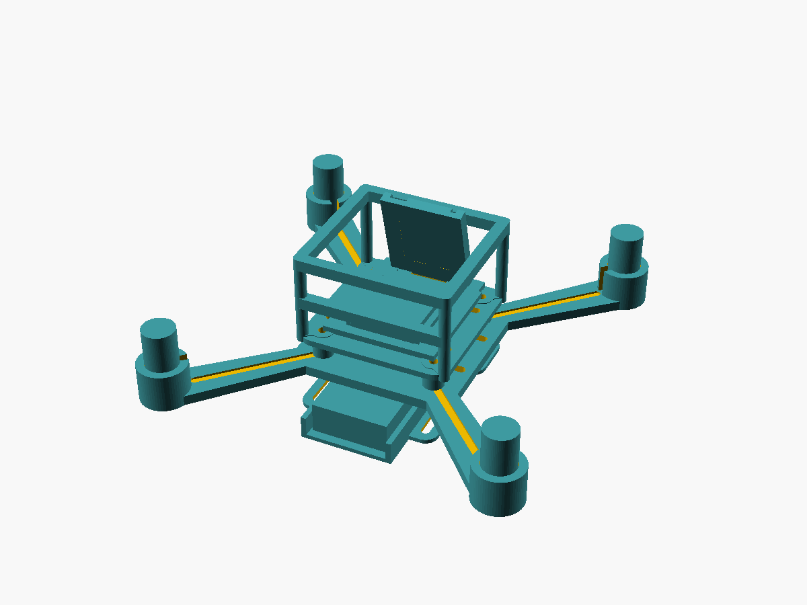

The current airframe is a modular **123 mm Quad-X** design with dedicated mounts for the 1S battery, electronics deck, XIAO ESP32-S3 Sense camera board, GY-91 IMU and a lightweight flight cage or closed canopy.

### How the STL parts fit together

The following view combines the actual printable Airframe V2 geometry with simplified mockups of the battery, four 8520 motors, electronics carrier, GY-91 and XIAO/camera. The mock electronics are shown only to explain placement; they are **not additional STL files**.


The exploded view makes the vertical stack and the purpose of each STL clearer:


| No. | STL | Purpose / installed component |
|---:|---|---|
| **1** | [`frame_v2.stl`](cad/airframe_v2/stl/frame_v2.stl) | Main load-bearing Quad-X frame. The four **8520 motors press into the motor cups** at the arm ends. |
| **2** | [`battery_sled_650_v2.stl`](cad/airframe_v2/stl/battery_sled_650_v2.stl) | Battery cradle **below the frame**; the 1S pack is moved longitudinally for CG adjustment. |
| **3** | [`electronics_deck_v2.stl`](cad/airframe_v2/stl/electronics_deck_v2.stl) | Upper carrier for the **MOSFET motor-driver/perfboard or custom PCB**. |
| **4** | [`imu_gy91_saddle.stl`](cad/airframe_v2/stl/imu_gy91_saddle.stl) | Mount for the **GY-91 IMU**, kept close to the aircraft center. |
| **5** | [`xiao_camera_mount_15deg.stl`](cad/airframe_v2/stl/xiao_camera_mount_15deg.stl) | Forward mount for the **XIAO ESP32-S3 Sense and camera**, approximately 15° nose-down. |
| **6** | [`flight_cage_v2.stl`](cad/airframe_v2/stl/flight_cage_v2.stl) | Lightweight protection around the electronics/camera stack; preferred for the flight build. |
| **7** | [`m2_spacers_5mm_set4.stl`](cad/airframe_v2/stl/m2_spacers_5mm_set4.stl) | Four 5 mm spacers between the main frame and electronics deck. |

Three STL files are **not additional mandatory layers** in the pictured stack:

- [`canopy_v2.stl`](cad/airframe_v2/stl/canopy_v2.stl) is an **alternative to** `flight_cage_v2.stl`, not something to install at the same time.
- [`prop_guard_corner_v2.stl`](cad/airframe_v2/stl/prop_guard_corner_v2.stl) is optional; print four for low-energy indoor testing and remove them for minimum flight mass.
- [`motor_cup_test_v2.stl`](cad/airframe_v2/stl/motor_cup_test_v2.stl) is a **calibration coupon only** and is never installed on the finished aircraft.

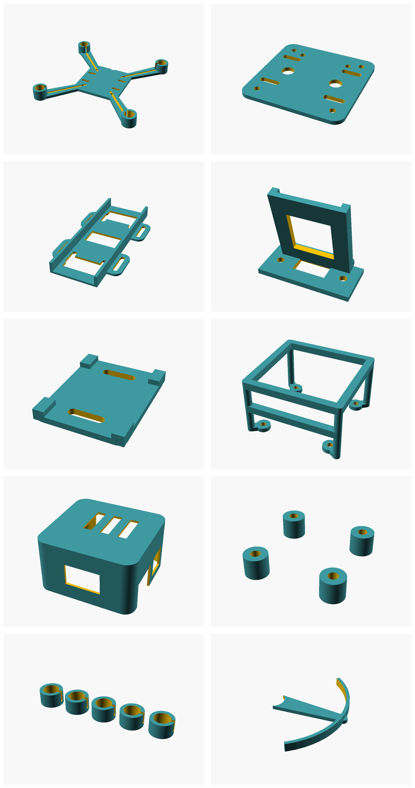

Detailed part descriptions, OpenSCAD sources, STL downloads, Kobra S1 print settings and validation notes are in **[`cad/airframe_v2/`](cad/airframe_v2/)**.

### Main printable parts

| Part | Preview | Source / STL |
|---|---|---|
| Main Quad-X frame | 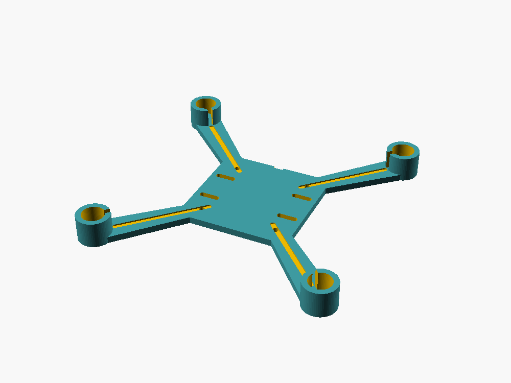 | [`frame_v2.scad`](cad/airframe_v2/scad/frame_v2.scad) · [`frame_v2.stl`](cad/airframe_v2/stl/frame_v2.stl) |
| Electronics deck | 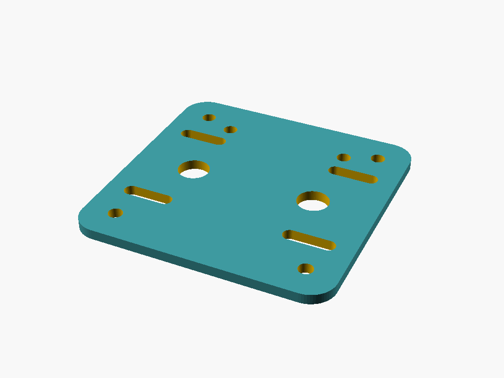 | [`electronics_deck_v2.scad`](cad/airframe_v2/scad/electronics_deck_v2.scad) · [`electronics_deck_v2.stl`](cad/airframe_v2/stl/electronics_deck_v2.stl) |
| Battery sled | 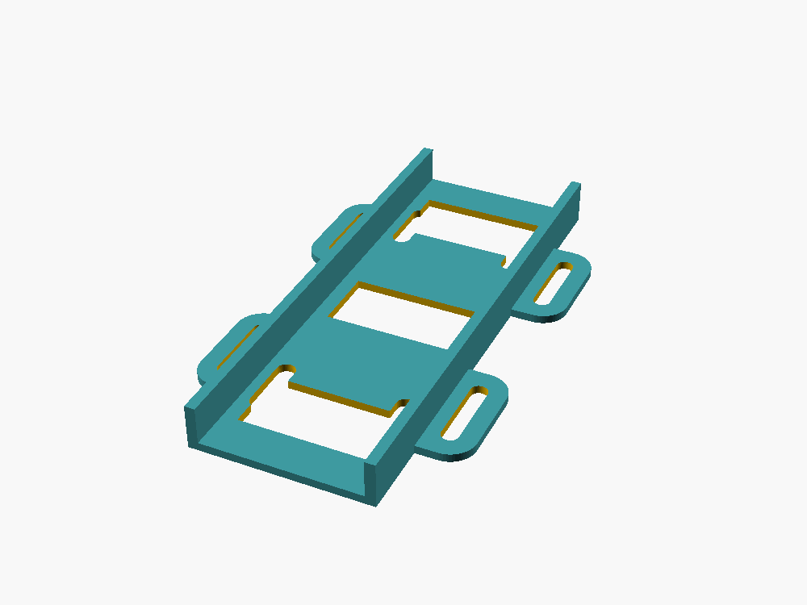 | [`battery_sled_650_v2.scad`](cad/airframe_v2/scad/battery_sled_650_v2.scad) · [`battery_sled_650_v2.stl`](cad/airframe_v2/stl/battery_sled_650_v2.stl) |
| XIAO camera mount | 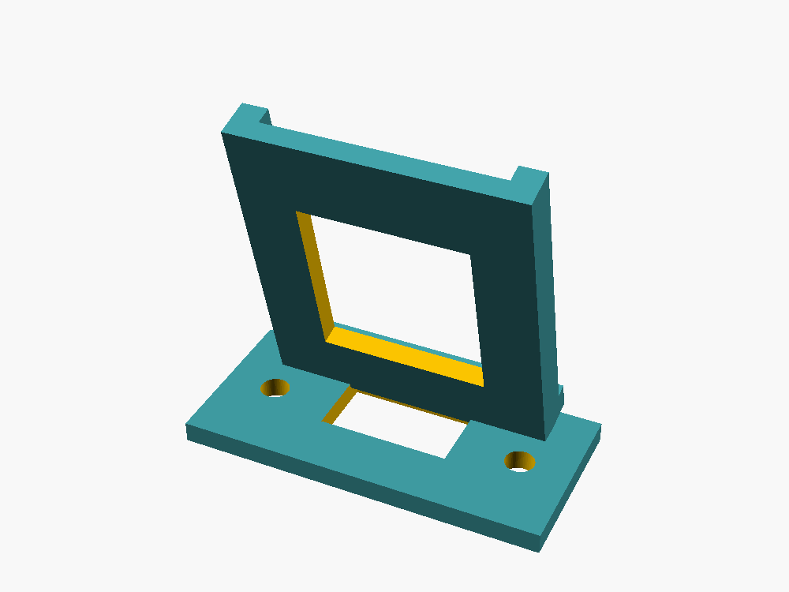 | [`xiao_camera_mount_15deg.scad`](cad/airframe_v2/scad/xiao_camera_mount_15deg.scad) · [`xiao_camera_mount_15deg.stl`](cad/airframe_v2/stl/xiao_camera_mount_15deg.stl) |
| GY-91 IMU saddle | 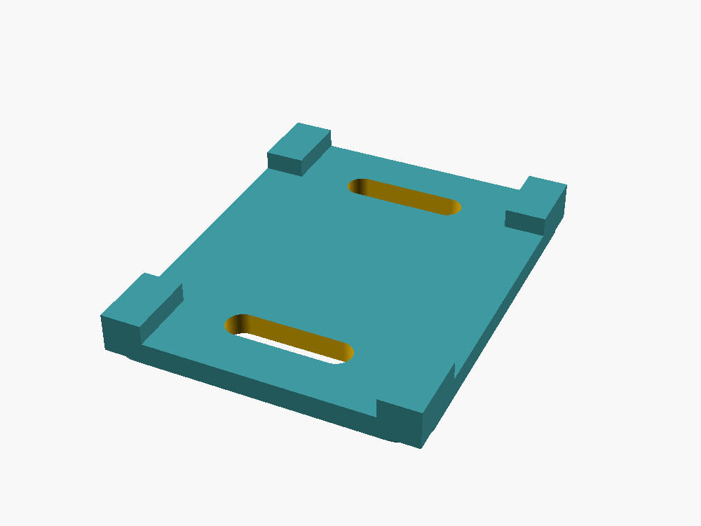 | [`imu_gy91_saddle.scad`](cad/airframe_v2/scad/imu_gy91_saddle.scad) · [`imu_gy91_saddle.stl`](cad/airframe_v2/stl/imu_gy91_saddle.stl) |
| Flight cage | 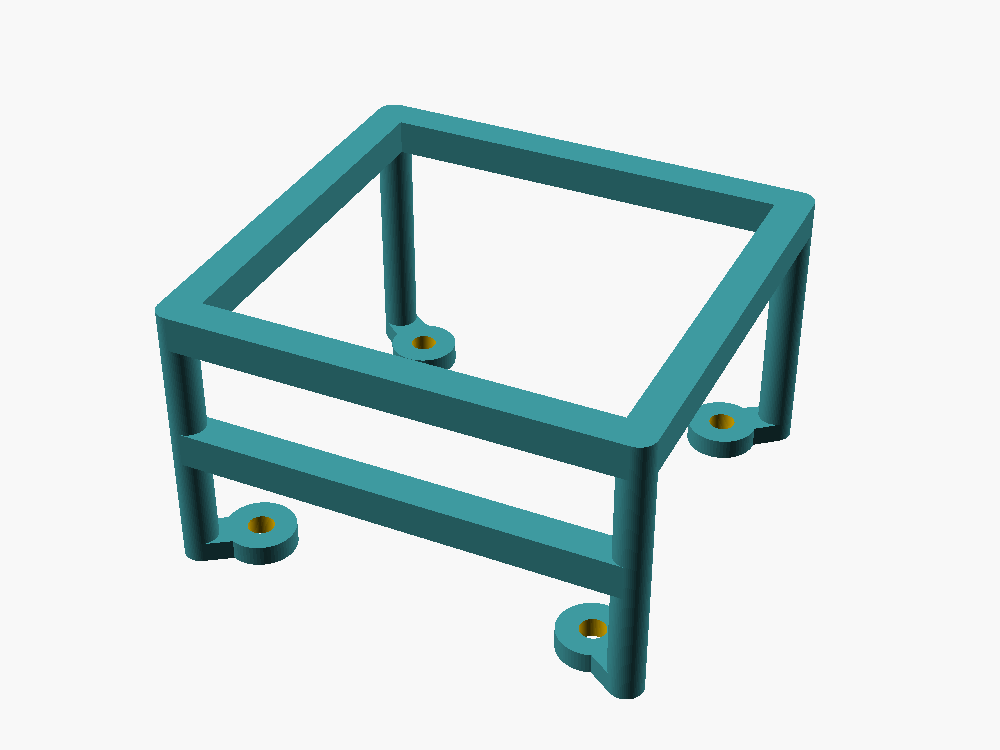 | [`flight_cage_v2.scad`](cad/airframe_v2/scad/flight_cage_v2.scad) · [`flight_cage_v2.stl`](cad/airframe_v2/stl/flight_cage_v2.stl) |
| Closed canopy | 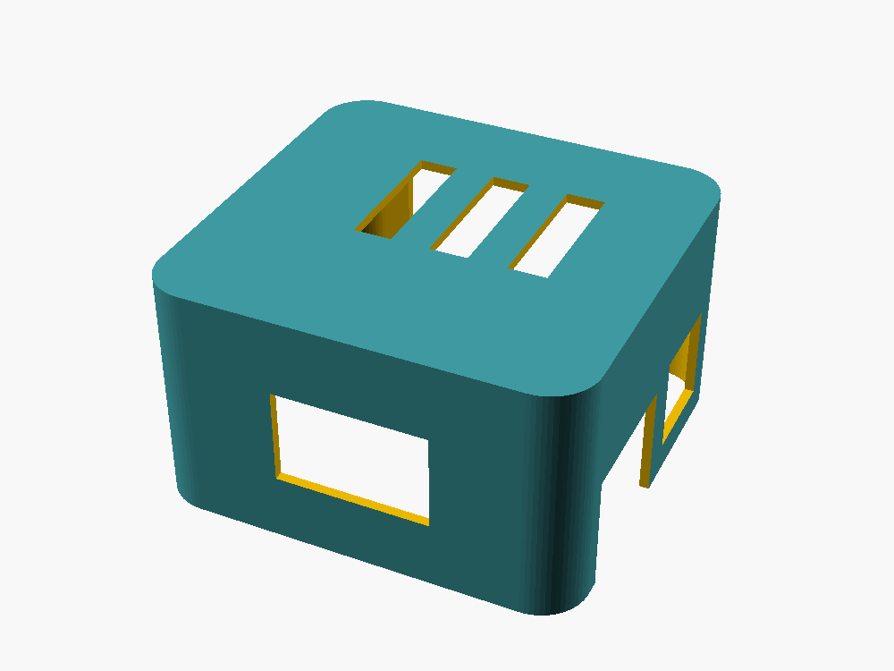 | [`canopy_v2.scad`](cad/airframe_v2/scad/canopy_v2.scad) · [`canopy_v2.stl`](cad/airframe_v2/stl/canopy_v2.stl) |
| Motor-cup fit test | 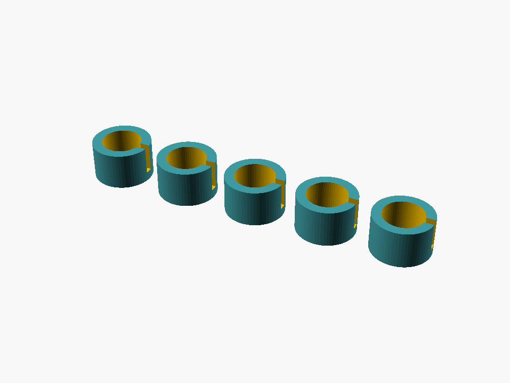 | [`motor_cup_test_v2.scad`](cad/airframe_v2/scad/motor_cup_test_v2.scad) · [`motor_cup_test_v2.stl`](cad/airframe_v2/stl/motor_cup_test_v2.stl) |

## Propellers and replacement CAD

The purchased 75 mm propellers can be used directly. Parametric replacement/test models are kept separately under [`cad/propellers/`](cad/propellers/) so the flight airframe and experimental propeller work remain clearly separated.

| Standard 75 mm | Experimental toroidal / low-noise concept |
|---|---|
| 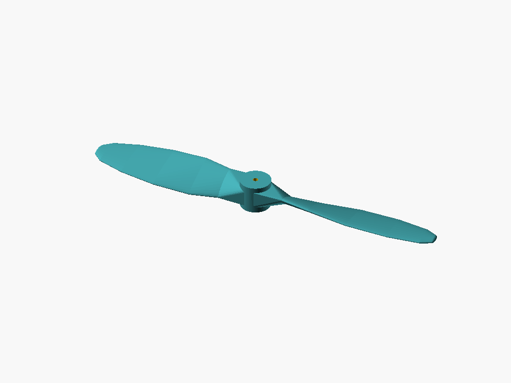 | 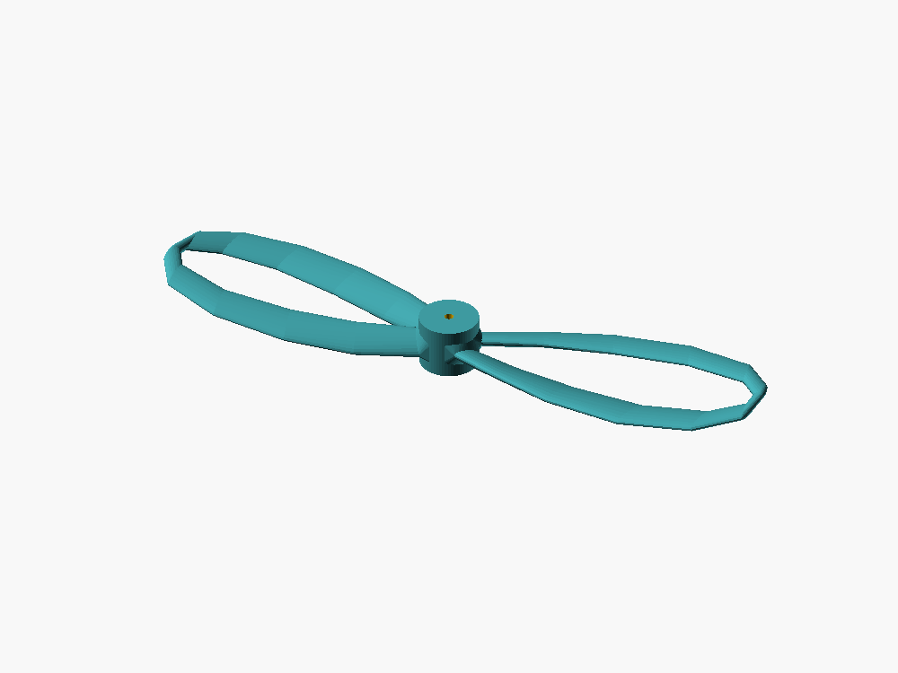 |

The repository includes CW/CCW STL exports and a 1 mm shaft-fit coupon. The toroidal model is experimental and should be bench-tested for current draw, vibration, balance and thrust before flight use.

## Design goals

- mostly printable micro quadcopter
- **123 mm diagonal motor-center wheelbase**
- **8520 brushed motors**, nominal 1.0 mm shafts
- **75/76 mm two-blade CW/CCW propellers**
- target takeoff mass around **60–80 g**
- XIAO ESP32-S3 Sense as flight/camera computer
- QVGA MJPEG live video over 2.4 GHz Wi-Fi
- MAVLink telemetry/control over UDP 14550
- stabilized/manual first-flight target
- printable on an Anycubic Kobra S1 with a 0.4 mm nozzle

## Repository layout

```text
.
├── README.md
├── bom/
├── cad/
│   ├── airframe_v2/
│   │   ├── scad/
│   │   ├── stl/
│   │   ├── renders/
│   │   └── tools/
│   └── propellers/
│       ├── scad/
│       ├── stl/
│       └── renders/
├── docs/
├── firmware/
└── hardware/
```

## Quick start

1. Read [`docs/01_BOM.md`](docs/01_BOM.md) and verify the actual delivered part dimensions.
2. Print [`cad/airframe_v2/stl/motor_cup_test_v2.stl`](cad/airframe_v2/stl/motor_cup_test_v2.stl) before committing to the full frame.
3. Print the Airframe V2 parts using the settings in [`docs/03_MECHANICAL.md`](docs/03_MECHANICAL.md).
4. Assemble electronics **without propellers**, following [`docs/02_ELECTRICAL.md`](docs/02_ELECTRICAL.md).
5. Run the bench firmware in [`firmware/bench_test/`](firmware/bench_test/) and verify IMU orientation and every motor channel.
6. Follow [`docs/05_BUILD_AND_TEST.md`](docs/05_BUILD_AND_TEST.md) and only then install balanced propellers.
7. Perform first hover tests using [`docs/06_FIRST_FLIGHT.md`](docs/06_FIRST_FLIGHT.md).

## Primary references

- Open32Drone: https://github.com/npu-ius-lab/open32drone
- ESP-FLY: https://github.com/Seeed-Projects/Co-Create_ESP-FLY
- XIAO ESP32-S3 Sense: https://wiki.seeedstudio.com/xiao_esp32s3_getting_started/

## Important safety rule

**Never test motor channels, arming logic, mixer direction or firmware changes with propellers fitted.** Verify motor order and direction at low output first. Printed propellers in particular require careful balancing and restrained bench testing before flight.

## License and attribution

Project documentation, original CAD and bench-test code are provided under Apache-2.0 unless a file states otherwise. Open32Drone source is not duplicated here. See [`NOTICE`](NOTICE) and [`LICENSE`](LICENSE).
