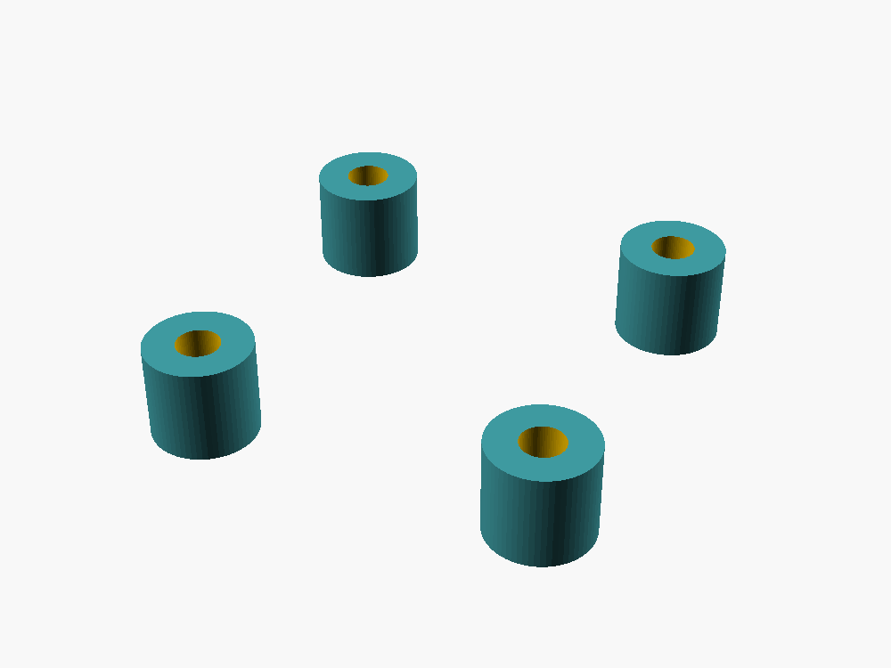
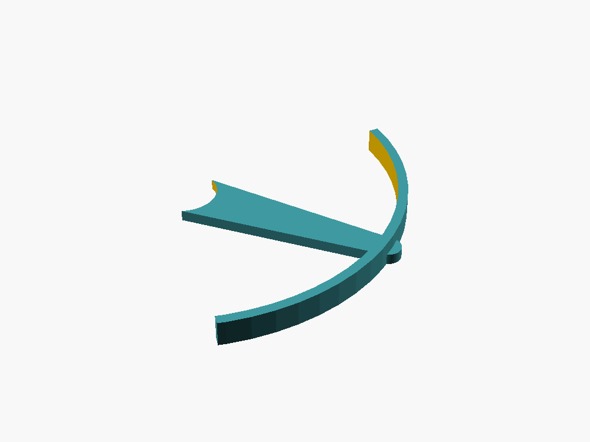

# IceDrone Airframe V2

This directory contains the **current** printable mechanical design for IceDrone. Airframe V2 replaces the earlier V1 frame/cradle set on `main` and provides a complete modular stack for the battery, electronics, XIAO ESP32-S3 Sense camera board, GY-91 IMU and protection cage/canopy.

## Design basis

- 123 mm Quad-X diagonal motor-center wheelbase
- motor centers at ±43.49 mm X/Y
- 8520 brushed coreless motors, nominal 8.5 mm diameter / 1.0 mm shaft
- 75/76 mm propellers
- shared 30 × 30 mm M2 mechanical stack
- 1S 550–650 mAh battery, nominal envelope up to about 62 × 20 × 8 mm
- XIAO ESP32-S3 Sense forward camera mount
- GY-91 IMU close to the geometric center
- Anycubic Kobra S1 / 0.4 mm nozzle target

> **Measure before the final flight print.** Marketplace GY-91 boards, 8520 motor cans and 1S batteries vary. Relevant dimensions are parameters in `scad/icedrone_v2_lib.scad`.

## Part preview and purpose

| Preview | OpenSCAD | STL | Purpose |
|---|---|---|---|
|  | [`frame_v2.scad`](scad/frame_v2.scad) | [`frame_v2.stl`](stl/frame_v2.stl) | Main 123 mm Quad-X frame with four 8520 motor cups and central 30 × 30 mm stack. |
|  | [`electronics_deck_v2.scad`](scad/electronics_deck_v2.scad) | [`electronics_deck_v2.stl`](stl/electronics_deck_v2.stl) | Carrier for the MOSFET/motor stage or small perfboard/PCB. |
|  | [`xiao_camera_mount_15deg.scad`](scad/xiao_camera_mount_15deg.scad) | [`xiao_camera_mount_15deg.stl`](stl/xiao_camera_mount_15deg.stl) | Forward camera holder, about 15° nose-down, open for cooling. |
|  | [`imu_gy91_saddle.scad`](scad/imu_gy91_saddle.scad) | [`imu_gy91_saddle.stl`](stl/imu_gy91_saddle.stl) | Centered IMU saddle; TPU 95A preferred for mild vibration isolation. |
|  | [`battery_sled_650_v2.scad`](scad/battery_sled_650_v2.scad) | [`battery_sled_650_v2.stl`](stl/battery_sled_650_v2.stl) | Lower sliding battery cradle for CG adjustment. |
|  | [`flight_cage_v2.scad`](scad/flight_cage_v2.scad) | [`flight_cage_v2.stl`](stl/flight_cage_v2.stl) | Lightweight recommended protection over the electronics stack. |
|  | [`canopy_v2.scad`](scad/canopy_v2.scad) | [`canopy_v2.stl`](stl/canopy_v2.stl) | Closed, heavier protection option. |
|  | [`m2_spacers_5mm_set4.scad`](scad/m2_spacers_5mm_set4.scad) | [`m2_spacers_5mm_set4.stl`](stl/m2_spacers_5mm_set4.stl) | Four 5 mm M2 spacers. |
|  | [`prop_guard_corner_v2.scad`](scad/prop_guard_corner_v2.scad) | [`prop_guard_corner_v2.stl`](stl/prop_guard_corner_v2.stl) | Optional single-corner guard; print four if used. |
|  | [`motor_cup_test_v2.scad`](scad/motor_cup_test_v2.scad) | [`motor_cup_test_v2.stl`](stl/motor_cup_test_v2.stl) | Five 8520 press-fit samples: 8.55–8.75 mm. Print this first. |

[`icedrone_v2_lib.scad`](scad/icedrone_v2_lib.scad) contains the shared parametric geometry. [`assembly_preview_v2.scad`](scad/assembly_preview_v2.scad) is a non-printable scene used for the assembly visualization.

## Recommended flight stack

1. `battery_sled_650_v2.stl`
2. `frame_v2.stl`
3. four 5 mm M2 spacers
4. `electronics_deck_v2.stl`
5. `flight_cage_v2.stl` or `canopy_v2.stl`

## Motor cup calibration

Print `stl/motor_cup_test_v2.stl` first and test the actual delivered motors. Use the smallest cup with a firm press fit that does not deform the motor or crack the cup, then set `motor_id` in `scad/icedrone_v2_lib.scad` and re-render the frame if required.

## Kobra S1 guidance

| Part | Material | Layer | Walls | Infill | Support |
|---|---|---:|---:|---:|---|
| Frame | PETG | 0.16–0.20 mm | 4 | 100% | none |
| Electronics deck | PETG | 0.16–0.20 mm | 3–4 | 60–100% | none |
| XIAO mount | PETG/TPU 95A | 0.16–0.20 mm | 3 | 50–100% / 25–40% | normally none |
| IMU saddle | TPU 95A preferred | 0.20 mm | 3 | 20–35% | none |
| Battery sled | PETG/TPU | 0.16–0.20 mm | 3 | 50–100% | none |
| Flight cage | PETG | 0.16 mm | 3 | 100% | support top bridges only |
| Canopy | PETG | 0.16–0.20 mm | 3 | 60–100% | roof-down; support as needed |

## Validation

- [`PARTS_MANIFEST.csv`](PARTS_MANIFEST.csv)
- [`STL_VALIDATION.csv`](STL_VALIDATION.csv)

The exported flight STL files were checked as closed meshes. Multi-part test/set STL files intentionally contain more than one disconnected body.

## Safety

Complete all electrical, motor-order, motor-direction, IMU-orientation and failsafe tests **without propellers installed**. Use eye protection and restrain the airframe for the first powered propeller tests.
