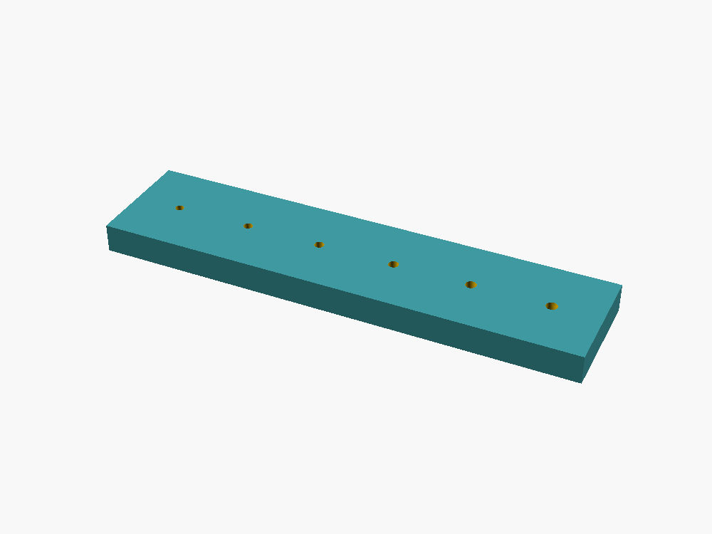

# IceDrone 75 mm Propeller CAD

Parametric replacement and experimental propeller models for the 8520 brushed motor configuration used by IceDrone. The purchased molded 75 mm propellers remain the preferred baseline for first flight.

## Standard replacement model

- nominal diameter: 75 mm
- two blades
- 1.0 mm nominal motor shaft
- CW and CCW STL exports
- OpenSCAD source: [`scad/icedrone_prop_75mm_standard.scad`](scad/icedrone_prop_75mm_standard.scad)

STL:
- [`stl/IceDrone_75mm_Standard_CW.stl`](stl/IceDrone_75mm_Standard_CW.stl)
- [`stl/IceDrone_75mm_Standard_CCW.stl`](stl/IceDrone_75mm_Standard_CCW.stl)

## Experimental toroidal / low-noise model

The toroidal model applies the looped-blade concept discussed in MIT Lincoln Laboratory's toroidal propeller work and in the referenced Slashcam article. It is an **experimental scaling to a 75 mm / 8520 brushed platform**; acoustic and efficiency results from larger prototypes should not be assumed to transfer directly.

OpenSCAD:
- [`scad/icedrone_prop_75mm_toroidal.scad`](scad/icedrone_prop_75mm_toroidal.scad)

STL:
- [`stl/IceDrone_75mm_Toroidal_Quiet_CW.stl`](stl/IceDrone_75mm_Toroidal_Quiet_CW.stl)
- [`stl/IceDrone_75mm_Toroidal_Quiet_CCW.stl`](stl/IceDrone_75mm_Toroidal_Quiet_CCW.stl)

References:
- https://www.ll.mit.edu/partner-us/available-technologies/toroidal-propeller-0
- https://www.slashcam.de/news/single/Weniger-Sirren--Neues-Rotorendesign-macht-Drohnen--17711.html

## 1 mm shaft-fit coupon

Print the fit coupon before relying on a printed press-fit hub. It contains several hole sizes around the nominal 1.0 mm shaft so printer/material shrinkage can be measured.

- OpenSCAD: [`scad/shaft_fit_coupon_1mm.scad`](scad/shaft_fit_coupon_1mm.scad)
- STL: [`stl/IceDrone_1mm_Shaft_Fit_Coupon.stl`](stl/IceDrone_1mm_Shaft_Fit_Coupon.stl)

## Printing and test safety

Printed propellers are high-RPM rotating parts. Inspect them for layer defects, balance them, run initial tests restrained and at low PWM, and increase speed only while monitoring vibration and motor current. Do not stand in the propeller plane during testing.
