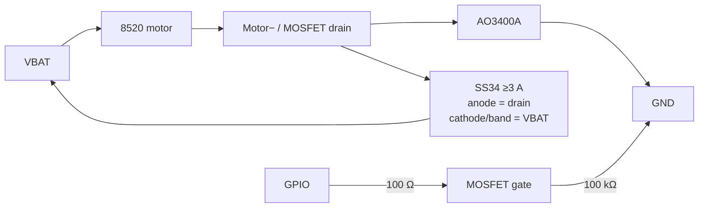

[← Docs index](README.md)

# 02 - Electrical — IceDrone V3.4


Authoritative machine-readable files:

- [`hardware/motor_stage_netlist.csv`](../hardware/motor_stage_netlist.csv)
- [`hardware/pinmap.csv`](../hardware/pinmap.csv)
- [`hardware/perfboard_v34_netlist.csv`](../hardware/perfboard_v34_netlist.csv)
- [`hardware/perfboard_v34_pin_matrix.csv`](../hardware/perfboard_v34_pin_matrix.csv)

> **Revision note:** V3.4 supersedes the earlier V1/V3.2/V3.3 electrical notes. In particular, M2 uses GPIO44/D7 instead of GPIO3, D1-D4 are SS34-class flyback diodes, the XIAO is powered from a regulated 5 V boost path, and the photographed VL6180X module has a verified seven-pin order.

## Power architecture

IceDrone V3.4 uses a raw **1S LiHV VBAT rail** for the brushed motors and the FH-1502 gimbal. A fully charged 1S LiHV cell can reach 4.35 V.

The XIAO ESP32-S3 Sense is **not** connected directly to raw VBAT in this revision. Use:

`VBAT → off-board 1S→5V boost → D5 Schottky → XIAO 5V`

The common ground is shared. The XIAO's regulated 3V3 output then powers the GY-91 and the VL6180X breakout.

### Required suppression and filtering

- C1: **470 µF / 10 V low-ESR** across VBAT/GND
- C2: **100 µF / 10 V low-ESR** across VBAT/GND
- C3: **100 nF ceramic** from VBAT_ADC to GND, in parallel with R10
- D1-D4: **SS34-class ≥3 A Schottky** flyback diodes
- one additional **100 nF ceramic directly across each motor's terminals**
- short, wide VBAT/GND/motor-current wiring
- twisted motor wire pairs where practical
- keep ADC and I2C wiring away from motor drain/PWM wiring

## Motor driver channel

Each motor is low-side switched by an AO3400A:



The gate pulldown is mandatory because it holds the MOSFET off while the ESP32 GPIO is high impedance during boot.

### AO3400A pinout

For the SOT-23 AO3400A package:

- pin 1 = Gate
- pin 2 = Source
- pin 3 = Drain

On perfboard use a SOT-23 adapter or very short dead-bug leads. Do not infer the electrical node from the physical drawing alone; follow the netlist.

## GPIO map

| Function | XIAO pin / GPIO | Notes |
|---|---|---|
| M1 rear-left | D3 / GPIO4 | PWM |
| M2 rear-right | **D7 / GPIO44** | PWM; changed from GPIO3 in V3.4 |
| M3 front-right | D5 / GPIO6 | PWM |
| M4 front-left | D4 / GPIO5 | PWM |
| Battery ADC | D0 / GPIO1 | 100k/100k divider + 100 nF filter |
| I2C SDA | D1 / GPIO2 | GY-91 + VL6180X |
| I2C SCL | D6 / GPIO43 | GY-91 + VL6180X |
| Gimbal PWM | GPIO42 test pad | conflicts with Sense PDM microphone clock |

GPIO3 is intentionally left unused in V3.4. The Sense camera GPIO set and microSD GPIO7/8/9/21 are preserved.

## I2C requirement

Because GPIO5 and GPIO6 are motor PWM outputs, do not rely on the XIAO default I2C pins.

Firmware must explicitly initialize:

```cpp
Wire.begin(2, 43);
```

## Battery measurement

R9 and R10 form a 100k/100k divider:

`VBAT → R9 → VBAT_ADC → R10 → GND`

C3 = 100 nF is placed in parallel with R10 to suppress motor brush noise.

Nominally:

`V_ADC = VBAT / 2`

At 4.35 V battery voltage the ADC node is about 2.175 V.

In firmware start with:

`VBAT = V_ADC * 2.0`

and calibrate against a multimeter.

## VL6180X — photographed module

With the actual module front side visible, text upright and header at the bottom, the physical pin order is:

`VIN | 2V8 | GND | GPIO | SHDN | SCL | SDA`

V3.4 uses:

- VIN → XIAO 3V3
- GND → common GND
- SCL → GPIO43 / D6
- SDA → GPIO2 / D1
- SHDN → optional / normally NC
- 2V8 → NC
- GPIO → NC

Do **not** connect the module's 2V8 output to the XIAO 3V3 rail.

## Perfboard coordinate convention

The 70×30 mm perfboard uses this fixed convention:

| View | left → right | top → bottom |
|---|---|---|
| component side | A B C D E F G H I J | 1…24 |
| solder side | J I H G F E D C B A | 1…24 |

- `A1-A24` = VBAT
- `J1-J24` = GND
- `E12` = unused

The detailed construction guide and rear-view solder map are in [10 - Perfboard V3.4 soldering](10_PERFBOARD_V34_SOLDERING_DE.md).

## Current-separation rule

Dupont/breadboard jumper wires are only for low-current module and signal connections.

Do **not** route battery or 8520 motor current through Dupont jumpers. Use BT2.0/JST-XH or equivalent appropriately rated wiring/connectors for battery and motor current.

## Before connecting the XIAO

1. continuity-test VBAT-to-GND; no hard short may be present;
2. verify every MOSFET source is at GND;
3. verify each drain is only on its own motor−/flyback node;
4. verify D1-D4 cathode bands point toward VBAT;
5. verify D5 cathode points toward XIAO 5V;
6. verify C1/C2 polarity;
7. verify raw VBAT has no direct path to XIAO 5V;
8. verify boost output before connecting the XIAO;
9. first power-up with propellers removed and preferably with a current-limited bench supply.

---
[← 01 - BOM](01_BOM.md) | [Docs index](README.md) | Next: [03 - Mechanical →](03_MECHANICAL.md)
