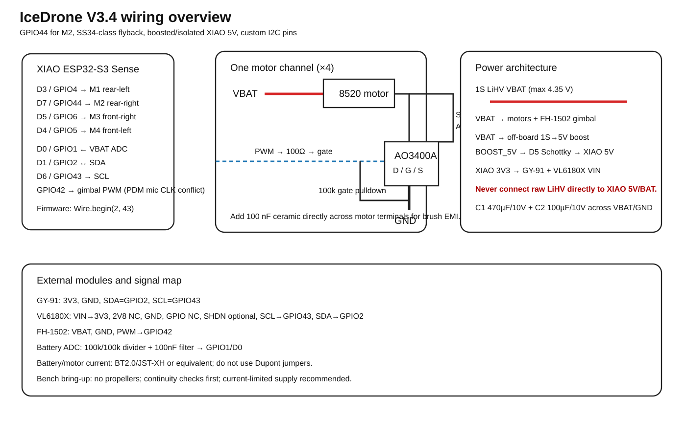
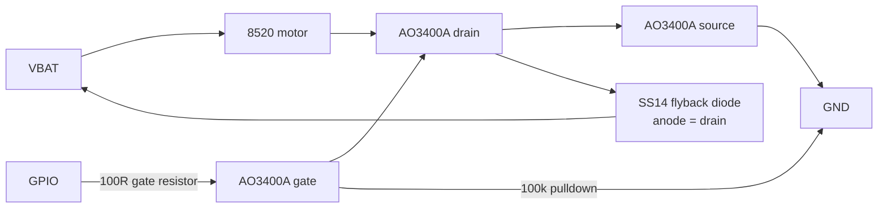

[← Docs index](README.md)

# 02 - Electrical

Full motor-stage netlist: [`hardware/motor_stage_netlist.csv`](../hardware/motor_stage_netlist.csv). Pin map: [`hardware/pinmap.csv`](../hardware/pinmap.csv).

## Power architecture

The entire V1 uses a **single 1S battery rail**. The motors are connected directly to VBAT and low-side switched by AO3400A MOSFETs. The XIAO is powered from its battery input; the IMU is powered from the XIAO 3V3 rail.

Do **not** add the Open32Drone 5 V boost module in V1 unless an optional sensor specifically needs 5 V. Removing it saves weight and reduces switching-noise sources.

### Recommended suppression

- C1: 470 µF low-ESR across VBAT/GND at the motor stage
- C2: 100 µF across VBAT/GND near the XIAO battery input
- 100 nF ceramic close to the IMU supply
- one SS14 flyback diode per motor: anode to MOSFET drain / motor negative, cathode to VBAT
- short, wide battery and motor power wiring
- route IMU I2C away from motor leads

## Motor driver channel

Each of the four motor channels is identical:

Reference designators, from [`hardware/motor_stage_netlist.csv`](../hardware/motor_stage_netlist.csv):

| Ref | Value/Part | Connection 1 | Connection 2 | Connection 3 | Notes |
|---|---|---|---|---|---|
| Q1 | AO3400A | D=Motor1- | S=GND | G=R1_out | Rear-left |
| Q2 | AO3400A | D=Motor2- | S=GND | G=R2_out | Rear-right |
| Q3 | AO3400A | D=Motor3- | S=GND | G=R3_out | Rear-front-right |
| Q4 | AO3400A | D=Motor4- | S=GND | G=R4_out | Front-left |
| R1-R4 | 100R | GPIO PWM | Q gate | – | Gate damping |
| R5-R8 | 100k | Q gate | GND | – | Gate pulldown |
| D1-D4 | SS14 | Anode=Q drain | Cathode=VBAT | – | Flyback clamp; one per motor |
| C1 | 470uF 6.3V low-ESR | VBAT | GND | – | Bulk motor transient suppression |
| C2 | 100uF 6.3V low-ESR | VBAT | GND | – | Near XIAO BAT input |
| C3 | 100nF ceramic | 3V3 | GND | – | Near IMU |
| R9 | 100k | VBAT | VBAT_ADC | – | Battery divider upper |
| R10 | 100k | VBAT_ADC | GND | – | Battery divider lower; ADC sees 0.5*VBAT |

Use four identical channels. The gate pulldown is important: it holds the motor off while the ESP32 boots and GPIOs are high impedance.

## Pin map

Full table, from [`hardware/pinmap.csv`](../hardware/pinmap.csv):

| Function | XIAO pin/GPIO | Direction | Notes |
|---|---|---|---|
| IMU SDA | D1 / GPIO2 | I/O | I2C 400 kHz |
| IMU SCL | D6 / GPIO43 | Output | I2C 400 kHz |
| Motor rear-left | D3 / GPIO4 | Output | 10 kHz PWM to AO3400A gate |
| Motor rear-right | D2 / GPIO3 | Output | 10 kHz PWM to AO3400A gate |
| Motor front-right | D5 / GPIO6 | Output | 10 kHz PWM to AO3400A gate |
| Motor front-left | D4 / GPIO5 | Output | 10 kHz PWM to AO3400A gate |
| Battery ADC | D0 / GPIO1 | Input | External 100k/100k divider from VBAT; do not exceed ADC input range |
| SBUS RX optional | D7 / GPIO44 | Input | Optional RC receiver |
| SBUS TX optional | D10 / GPIO9 | Output | Optional / reserve |
| Optical-flow RX optional | D9 / GPIO8 | Input | Future V2 |
| Optical-flow TX optional | D8 / GPIO7 | Output | Future V2; conflicts with microSD if enabled |
| Camera | internal Sense B2B GPIO10-18/38-40/47-48 | I/O | Do not reassign |

The current Open32Drone documentation uses the same four motor GPIOs and I2C pins. The XIAO Sense camera itself uses internal GPIO10-18, 38-40, 47 and 48; therefore these pins must not be reused by the carrier.

## Battery measurement

A 100k/100k divider from VBAT to GPIO1 gives:

`V_ADC = VBAT / 2`

At 4.35 V LiHV full charge this is ~2.175 V, comfortably below 3.3 V. In firmware:

`VBAT = V_ADC * 2.0`

Calibrate the multiplier against a multimeter because ESP32 ADC gain varies. A practical calibration is to read at two battery voltages (near 4.1 V and 3.6 V) and fit a scale/offset.

## Grounding

Use a star-like layout: battery ground enters the motor-driver board near the bulk capacitor. Motor currents should return directly to this point. Keep the XIAO/IMU ground path separate from the motor return as far as practical before joining at the battery ground region.

## Before plugging in the XIAO

1. continuity test VBAT-to-GND: there must be no hard short;
2. check every MOSFET source is GND;
3. check each drain goes only to its motor negative and flyback diode anode;
4. verify diode polarity;
5. verify PH2.0 polarity with a multimeter;
6. power from a current-limited bench supply at 3.7 V first if available;
7. only then install the XIAO, still **without propellers**.

---
[← 01 - BOM](01_BOM.md) | [Docs index](README.md) | Next: [03 - Mechanical →](03_MECHANICAL.md)
