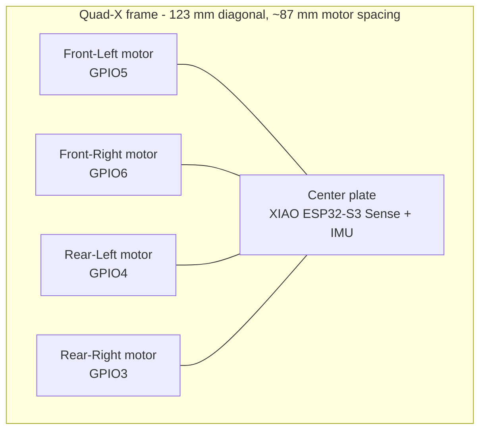

# 03 - Mechanical

> CAD sources (`cad/*.scad`, STL exports and renders) are not yet part of this repository. This document records the design intent and print settings so the frame can be reproduced once the CAD files are added.

## Frame geometry

The V1 frame is a 123 mm diagonal Quad-X frame. Motor centers are at ±43.49 mm X/Y. Adjacent motor spacing is ~87 mm. A 76 mm prop has 38 mm radius, leaving about 11 mm theoretical gap between neighboring prop discs.

### Frame features

- 8.65 mm motor cup ID for nominal 8.5 mm motors
- 12.8 mm cup OD
- 10 mm cup height
- 7 mm arms, 2.5 mm thick
- 42 mm central plate
- 30×30 mm M2 mounting pattern
- two battery-strap slots
- motor cup relief slots for motor wiring and slight compliance

## Camera cradle

An open cradle for the XIAO Sense stack, with a nominal 15° camera attitude, intentionally open for cooling: the XIAO Sense can become hot during continuous Wi-Fi/camera load.

Recommended material: TPU 95A. PETG works for initial fitting but transmits more vibration.

## Battery cradle

Targets batteries up to roughly 62×20×8 mm. Battery dimensions vary substantially even at the same capacity. Measure your actual pack before final printing and adjust the cradle dimensions if needed.

## Optional prop guard

A corner guard is optional and is **not** part of the weight target. Print four if you are doing low-energy indoor testing. Remove them for the best thrust-to-weight ratio.

## Kobra S1 print settings

### Frame - PETG

- nozzle: 0.4 mm
- layer: 0.16-0.20 mm
- walls: 4
- top/bottom: 4
- infill: 100% (thin geometry; actual mass penalty is small)
- supports: none
- orientation: flat on central plate
- brim: 3-5 mm if motor cups show edge lift

Start with your proven PETG profile rather than over-optimizing speed. Arm layer adhesion matters more than cosmetic surface quality.

### Camera cradle - TPU 95A

- layer: 0.20 mm
- walls: 3
- infill: 20-35%
- print slowly enough to prevent under-extrusion
- no support if your slicer bridges the shallow wedge acceptably

### Prototype in PLA

PLA is fine for a geometry/check-fit prototype and usually gives the cleanest motor-cup dimensions. The final flight frame is better in PETG because it tolerates impacts without brittle fracture.

## Tolerance checks

Print a single 12.8 mm OD / 8.65 mm ID motor cup test before printing the whole frame if your printer has not been dimensionally calibrated. The motor should press in firmly without crushing the can. If too tight, increase the motor cup ID in 0.05 mm steps.

## Center of gravity

Place the battery below the center plate and slide it longitudinally until CG is under the geometric center. The camera should face toward the front between the two front motors. The IMU should be as close to the center as practical and mounted flat relative to the frame axes.
