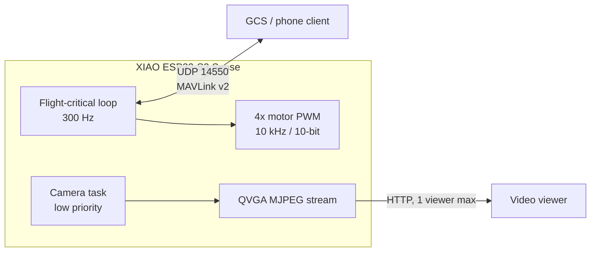

# 04 - Firmware

## Strategy

The flight-critical code should track Open32Drone rather than being reimplemented from scratch in this repo. The current upstream project documents:

- XIAO ESP32-S3 Sense
- ESP32 Arduino Core 3.3.6
- 300 Hz flight-critical main loop
- 10 kHz / 10-bit motor PWM
- optional QVGA MJPEG stream in a separate low-priority task
- MAVLink v2 over UDP 14550
- Wi-Fi AP fallback
- current motor GPIOs 4/3/6/5
- IMU I2C on GPIO2/43



Fetch Open32Drone from its upstream repository (see `docs/SOURCES.md`) and record the exact revision used in your build log, e.g. `git -C vendor/open32drone rev-parse HEAD`.

## Arduino build settings

For the current upstream documentation:

- Board: `XIAO_ESP32S3`
- ESP32 Arduino Core: 3.3.6
- OPI PSRAM: enabled
- flash mode: DIO as documented by upstream
- partition: upstream's documented 8 MB A/B/default partition
- serial monitor: 115200

Do not casually update the ESP32 core on a flight-tested build. Re-run all prop-off and tethered tests after framework upgrades.

## Local V1 choices

The intended V1 policy, to be applied as Open32Drone configuration settings:

- camera enabled
- QVGA
- one viewer maximum
- MJPEG quality starting point 18
- MAVLink port 14550
- optical flow disabled for V1
- SBUS disabled for V1
- battery divider factor 2.0
- low-voltage warning/landing thresholds as initial values only

These are a project manifest, not a guaranteed drop-in upstream header, because upstream changes. Apply the corresponding settings to the current Open32Drone configuration and document the resulting diff in your fork.

## Video

Use the upstream bounded background stream. Keep these design rules:

1. control loop wins over video;
2. one video client maximum;
3. QVGA first;
4. drop frames instead of growing queues;
5. if loop timing degrades, reduce frame rate/quality before touching flight-control rates;
6. never use the SD card in V1; D7-D10 are more useful as expansion/RC pins and the card adds I/O load.

The stream URL in current Open32Drone documentation is `http://192.168.4.1/stream` when using its default AP address.

## MAVLink / control

Default UDP port is 14550. For first testing, use a single GCS/phone client. Do not fly solely by looking at MJPEG video until measured end-to-end latency is acceptable; ESP32 MJPEG is suitable for inspection and slow FPV, not low-latency racing.

## Bench-test firmware

[`firmware/bench_test/main.cpp`](../firmware/bench_test/main.cpp) is intentionally **not a flight controller**. It performs three safe integration checks:

- initializes the XIAO Sense camera and captures a JPEG;
- prints IMU values if a supported test IMU is connected;
- pulses one selected motor at low duty for 250 ms.

Build with PlatformIO:

```bash
cd firmware/bench_test
pio run -t upload
pio device monitor
```

**Remove all propellers before running it.**

Note: the bench sketch uses Adafruit MPU6050 for a simple library-based smoke test. If the final board uses GY-91/MPU9250, validate it with Open32Drone's actual IMU backend as part of the upstream bring-up.
