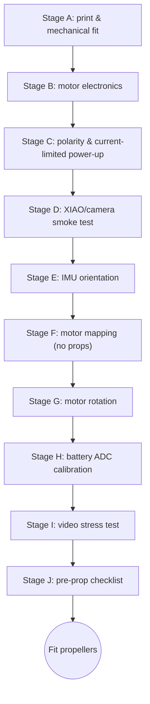

# 05 - Build and Test

## Stage A - print and mechanical fit

1. Print the frame.
2. Test-fit all four 8520 motors before wiring.
3. Verify each shaft is 1.0 mm.
4. Test-fit one propeller only for bore fit, then remove it again.
5. Fit XIAO/camera cradle and battery cradle; do not permanently glue anything yet.

## Stage B - build motor electronics

Work one channel at a time. After each channel, continuity-test it against [`hardware/motor_stage_netlist.csv`](../hardware/motor_stage_netlist.csv).

Recommended order:

1. 100 kΩ gate pulldowns;
2. 100 Ω gate resistors;
3. AO3400A MOSFETs;
4. flyback diodes;
5. bulk capacitor;
6. battery connector;
7. motor leads;
8. XIAO/IMU wiring last.

## Stage C - polarity and current-limited power-up

With the XIAO removed:

- measure resistance VBAT-GND;
- verify PH2.0 polarity;
- if available, use a bench supply at 3.7 V with current limit 100 mA and no motors connected;
- then connect motors and increase current limit appropriately only after confirming no unexpected conduction.

A MOSFET fitted with wrong pin orientation can cause a motor to run immediately. Keep the airframe restrained and propellers removed.

## Stage D - XIAO/camera smoke test

Power by USB first. Verify:

- serial console appears;
- PSRAM is detected;
- camera initializes;
- repeated QVGA JPEG capture does not reset the board;
- camera ribbon and antenna remain secure.

Then power from battery and repeat.

## Stage E - IMU orientation

The IMU must be mounted rigidly and flat. With the frame stationary:

- gyro should settle near zero after bias learning/calibration;
- gravity magnitude should be near 1 g;
- roll right should produce the expected roll sign;
- nose down/up should produce the expected pitch sign.

If axis signs are wrong, fix the software orientation or physical placement before motor tests. Never compensate a sign error by swapping random motor channels.

## Stage F - motor mapping, no props

Use the bench-test firmware or Open32Drone CLI. Identify physically:

- M0 rear-left
- M1 rear-right
- M2 front-right
- M3 front-left

Pulse each separately. Label wires if necessary.

## Stage G - motor rotation

For brushed motors, reverse direction by swapping the two motor wires. Configure the Quad-X rotation pattern expected by the current Open32Drone mixer. Do not infer direction from wire colors; vendors are inconsistent.

## Stage H - battery ADC calibration

1. connect a partly charged battery;
2. measure actual VBAT at the connector with a multimeter;
3. read firmware battery voltage;
4. calculate correction factor;
5. repeat at a second voltage;
6. store calibration.

## Stage I - video stress test

On battery power, without props:

1. start telemetry;
2. start the MJPEG viewer;
3. leave the system running 10 minutes;
4. monitor resets, temperature, loop rate, dropped frames and Wi-Fi loss;
5. gently move/rotate the frame and confirm IMU remains responsive.

If the XIAO becomes excessively hot or resets, reduce camera load and improve airflow before flight.

## Stage J - pre-prop checklist

All must be true:

- [ ] no VBAT/GND short
- [ ] correct battery polarity
- [ ] camera stable for 10 min
- [ ] IMU axes correct
- [ ] all four motor channels correct
- [ ] rotation directions correct
- [ ] arming/disarming works
- [ ] loss-of-control failsafe tested on bench
- [ ] battery voltage plausible
- [ ] frame has no cracks
- [ ] motor cups retain motors firmly
- [ ] antenna secured away from prop discs

Only then install propellers.
