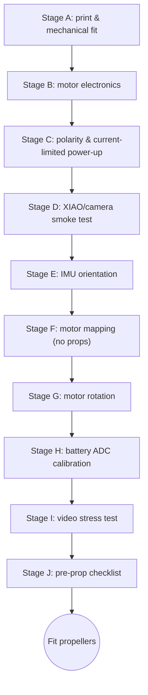

[← Docs index](README.md)

# 05 - Build and Test

Step-by-step assembly and bring-up, from printed parts to a prop-off validated airframe. Follow the stages in order — each one gates the next.

## Tools and consumables

- Soldering iron + fine tip, thin solder, flux
- Multimeter (continuity + DC voltage)
- Bench power supply with adjustable current limit (or a current-limited USB source as a fallback for Stage C)
- Small Phillips/hex driver for M2 hardware
- Wire strippers for 26-30 AWG
- Isopropyl alcohol + brush/lint-free wipes (flux cleanup)
- Heat-shrink tubing, small assortment
- USB-C cable (data-capable, for XIAO flashing/serial)
- 3D printer with PETG and TPU 95A loaded (see `docs/03_MECHANICAL.md` for slicer settings)
- A permanent marker or wire labels

## Stage A - print and mechanical fit

1. Slice and print `cad/stl/frame_v1.stl` in PETG (settings in `docs/03_MECHANICAL.md`). If your printer is not dimensionally calibrated, first print a small motor-cup test coupon (see "Tolerance checks" in `docs/03_MECHANICAL.md`) rather than committing to the full frame.
2. Slice and print `cad/stl/camera_cradle_15deg.stl` in TPU 95A and `cad/stl/battery_cradle_650.stl` in PETG or TPU.
3. Optionally print 4x `cad/stl/prop_guard_corner.stl` if you plan low-energy indoor testing.
4. Test-fit all four 8520 motors into the frame's motor cups, one at a time. The motor should press in firmly without cracking the cup. Do not glue yet.
5. Verify each motor's shaft is 1.0 mm (per `docs/01_BOM.md` — 0.8 mm shafts will not take the specified propellers).
6. Test-fit one propeller on one motor only, for bore fit, then remove it again. No propellers may remain fitted beyond this point until Stage J is complete.
7. Fit the camera cradle and battery cradle onto the frame's M2 mounting pattern with M2 hardware, finger-tight. Do not permanently glue any part yet — you will still need access for wiring and the CG check in `docs/03_MECHANICAL.md`.

## Stage B - build motor electronics

Work one motor channel at a time and continuity-test each channel against [`hardware/motor_stage_netlist.csv`](../hardware/motor_stage_netlist.csv) before moving to the next. The four channels are electrically identical; only the GPIO and physical position differ (cross-reference [`hardware/pinmap.csv`](../hardware/pinmap.csv)):

| Channel | MOSFET | Gate resistor | Gate pulldown | Flyback diode | Position | GPIO |
|---|---|---|---|---|---|---|
| 1 | Q1 | R1 | R5 | D1 | Rear-left | GPIO4 |
| 2 | Q2 | R2 | R6 | D2 | Rear-right | GPIO3 |
| 3 | Q3 | R3 | R7 | D3 | Front-right | GPIO6 |
| 4 | Q4 | R4 | R8 | D4 | Front-left | GPIO5 |

For each channel, in order:

1. Solder the 100 kΩ gate pulldown (R5-R8) between the AO3400A gate pad and GND.
2. Solder the 100 Ω gate resistor (R1-R4) between the GPIO trace/pad and the gate.
3. Solder the AO3400A (Q1-Q4): source to GND, drain to the motor's negative lead pad.
4. Solder the SS14 flyback diode (D1-D4): cathode to VBAT, anode to the MOSFET drain / motor negative node.
5. Continuity-test with the multimeter: GND-to-source = short, drain-to-cathode-side = diode drop only (not a dead short), gate-to-GND through the 100 kΩ pulldown (not a short).
6. Only after all four channels pass step 5, solder the shared bulk capacitors: C1 (470 µF) across VBAT/GND at the motor stage, C2 (100 µF) across VBAT/GND near the XIAO BAT input, C3 (100 nF) near the IMU supply.
7. Solder the battery connector — a PH2.0 pigtail as designed, or whatever connector your actual battery uses (e.g. BT2.0, see `09_AMAZON_ORDER_LIST_DE.md`) — then the four motor leads (do not decide final rotation direction yet — that is Stage G).
8. Wire the XIAO and IMU last: VBAT ADC divider (R9/R10) from VBAT to GPIO1, IMU SDA/SCL to GPIO2/GPIO43, IMU power to the XIAO 3V3 rail.

## Stage C - polarity and current-limited power-up

With the XIAO still **not installed**:

1. Measure resistance VBAT-to-GND with the multimeter: must show no hard short (expect a high resistance / open reading, not near 0 Ω).
2. Verify the battery connector's polarity against the battery with the multimeter before ever plugging it in (PH2.0 or BT2.0, whichever your pack uses).
3. Connect a bench supply at 3.7 V with a 100 mA current limit, no motors' propellers fitted and no battery connected yet.
4. Confirm the supply stays in constant-voltage mode (not tripping the current limit) with the board otherwise unpowered — this rules out a gross short before any active part is powered.
5. Raise the current limit in small steps only after step 4 passes, then reconnect motors and repeat, watching for any channel drawing current with no GPIO driven.

A MOSFET fitted with wrong pin orientation can cause a motor to run immediately. Keep the airframe restrained and propellers removed throughout.

## Stage D - XIAO/camera smoke test

1. Install the XIAO ESP32-S3 Sense into its cradle (still without propellers anywhere on the airframe).
2. Flash `firmware/bench_test/main.cpp` with PlatformIO (see `docs/04_FIRMWARE.md`) and power the board over USB only (battery disconnected).
3. Open the serial monitor at 115200 baud and confirm:
   - the startup banner and "PROPS MUST BE REMOVED" message appear;
   - `Camera: OK` is printed;
   - sending `c` repeatedly returns a plausible JPEG byte count each time without a reset;
   - the camera ribbon and antenna remain physically secure while doing this.
4. Disconnect USB, connect the battery, and repeat step 3 on battery power.

## Stage E - IMU orientation

The IMU must be mounted rigidly and flat before this stage.

1. With the frame stationary on a level surface, send `i` repeatedly in the bench-test serial monitor and confirm gyro values settle near zero.
2. Confirm the reported acceleration magnitude is close to 1 g while stationary.
3. Tilt the frame roll-right and confirm the roll axis sign matches what your firmware/mixer expects; repeat nose-down for pitch.
4. If a sign is wrong, fix it in software orientation/axis remap or physically re-seat the IMU — never compensate an axis sign error by swapping motor channels later.

## Stage F - motor mapping, no props

Propellers remain off for this entire stage.

1. In the bench-test serial monitor, send `0`, then `1`, `2`, `3` one at a time.
2. For each command, physically identify which motor spins and confirm it matches the expected position from the Stage B table (0=rear-left/GPIO4, 1=rear-right/GPIO3, 2=front-right/GPIO6, 3=front-left/GPIO5 per `firmware/bench_test/main.cpp`'s `MOTOR_PINS` array and `hardware/pinmap.csv`).
3. Label each motor wire pair with its channel number if there is any ambiguity.
4. If a motor does not spin, recheck that channel's continuity from Stage B before applying more current.

## Stage G - motor rotation

1. For each motor, note its current spin direction from Stage F.
2. Determine the Quad-X rotation pattern required by the Open32Drone mixer you are running (see `docs/04_FIRMWARE.md`).
3. For any motor spinning the wrong way, swap its two motor leads (brushed motors reverse direction this way) — do not attempt to fix rotation in software for this build.
4. Re-run Stage F's per-channel pulse test after any lead swap to confirm the mapping is still correct.
5. Do not infer direction from wire insulation color; vendors are inconsistent — always verify by observation.

## Stage H - battery ADC calibration

1. Connect a partly charged battery and measure the actual VBAT at the connector with the multimeter.
2. Read the firmware's reported battery voltage (via bench-test serial output or Open32Drone telemetry) at the same moment.
3. Compute the correction factor: `actual_VBAT / reported_VBAT`.
4. Repeat at a second, clearly different charge level (e.g. near 4.1 V and again near 3.6 V).
5. Fit a scale/offset from the two data points rather than trusting a single-point calibration.
6. Store the resulting scale/offset in your firmware configuration (`docs/02_ELECTRICAL.md` gives the nominal `VBAT = V_ADC * 2.0` starting point).

## Stage I - video stress test

Still without propellers:

1. Power the airframe from battery.
2. Start MAVLink telemetry (UDP 14550) with a single GCS/phone client.
3. Start the MJPEG viewer against the stream URL from `docs/04_FIRMWARE.md`.
4. Let it run for 10 minutes continuously, watching for: unexpected resets, rising XIAO temperature, dropped video frames, Wi-Fi disconnects, and flight-loop timing degradation.
5. While it runs, gently move and rotate the frame by hand and confirm the IMU output (via telemetry) keeps responding smoothly.
6. If the XIAO becomes excessively hot or resets under load, reduce camera frame rate/JPEG quality and improve cradle airflow before proceeding — do not compensate by touching flight-control rates.

## Stage J - pre-prop checklist

All of the following must be true before any propeller is installed:

- [ ] no VBAT/GND short (Stage C)
- [ ] correct battery polarity confirmed with a multimeter (Stage C)
- [ ] camera stable for the full 10-minute test on battery power (Stage I)
- [ ] IMU axes verified correct (Stage E)
- [ ] all four motor channels spin the correct physical motor for their command (Stage F)
- [ ] rotation directions match the mixer's expected Quad-X pattern (Stage G)
- [ ] arming/disarming works as expected in the flight firmware
- [ ] loss-of-control failsafe tested on the bench (radio/Wi-Fi link loss triggers the expected behavior)
- [ ] battery voltage reading is plausible after ADC calibration (Stage H)
- [ ] frame has no visible cracks, especially at the arm/motor-cup junctions
- [ ] motor cups retain all four motors firmly, no play
- [ ] antenna secured and routed away from the propeller discs

Only once every box is checked, fit the propellers per the CW/CCW pattern from Stage G and continue to `docs/06_FIRST_FLIGHT.md`.

---
[← 04 - Firmware](04_FIRMWARE.md) | [Docs index](README.md) | Next: [06 - First Flight →](06_FIRST_FLIGHT.md)
