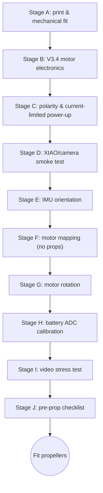

[← Docs index](README.md)

# 05 - Build and Test

Step-by-step assembly and bring-up for IceDrone V3.4. Follow the stages in order; each stage gates the next.

For the 70×30 mm perfboard prototype, use the detailed hole-by-hole guide:

**[10 - Perfboard V3.4 soldering and bring-up](10_PERFBOARD_V34_SOLDERING_DE.md)**



## Tools and consumables

- soldering iron + fine/chisel tip
- thin electronics solder + flux
- hot air optional for SMD work
- multimeter with continuity, resistance, diode and DC-voltage modes
- bench power supply with adjustable current limit strongly recommended
- SOT-23 adapter boards or material for very short dead-bug wiring
- 0.6–0.8 mm tinned copper wire for VBAT/GND rails
- 28–30 AWG insulated wire for signals
- 22–24 AWG or otherwise suitably rated wire for battery/motor current
- isopropyl alcohol + brush/lint-free wipes
- heat-shrink tubing
- USB-C data cable
- permanent marker / wire labels

## Stage A - print and mechanical fit

1. Print the current Airframe V2 parts from `cad/airframe_v2/`.
2. Test-fit all four 8520 motors before wiring.
3. Verify each motor shaft is 1.0 mm.
4. Test-fit one propeller for bore fit, then remove it again.
5. Fit XIAO/camera and battery holders but keep the electronics accessible.
6. Do not fit propellers again until Stage J is complete.

## Stage B - build V3.4 motor electronics

Use [`hardware/motor_stage_netlist.csv`](../hardware/motor_stage_netlist.csv), [`hardware/pinmap.csv`](../hardware/pinmap.csv) and, for perfboard, [`hardware/perfboard_v34_netlist.csv`](../hardware/perfboard_v34_netlist.csv).

| Channel | MOSFET | Gate resistor | Gate pulldown | Flyback diode | Position | GPIO |
|---|---|---|---|---|---|---|
| 1 | Q1 | R1 | R5 | D1 | rear-left | GPIO4 / D3 |
| 2 | Q2 | R2 | R6 | D2 | rear-right | **GPIO44 / D7** |
| 3 | Q3 | R3 | R7 | D3 | front-right | GPIO6 / D5 |
| 4 | Q4 | R4 | R8 | D4 | front-left | GPIO5 / D4 |

For each channel:

1. install the 100 kΩ gate pulldown;
2. install the 100 Ω gate resistor;
3. install the AO3400A with verified Gate/Source/Drain orientation;
4. install an **SS34-class ≥3 A Schottky** flyback diode:
   - anode = motor− / MOSFET drain
   - cathode/band = VBAT / motor+
5. verify source-to-GND continuity;
6. verify gate-to-GND is approximately 100 kΩ;
7. verify the flyback diode in diode mode;
8. verify there is no drain-to-GND hard short.

After all four channels pass:

- C1 = **470 µF / 10 V low-ESR** across VBAT/GND
- C2 = **100 µF / 10 V low-ESR** across VBAT/GND
- R9/R10 = 100k/100k battery divider
- C3 = 100 nF from ADC midpoint to GND
- one 100 nF ceramic directly across each motor's terminals

### V3.4 pin changes that must not be back-ported incorrectly

- M2 is **GPIO44 / D7**, not GPIO3.
- GPIO3 is intentionally unused.
- I2C is SDA=GPIO2/D1 and SCL=GPIO43/D6.
- firmware must call `Wire.begin(2, 43)`.
- D1-D4 are SS34-class, not SS14.
- raw LiHV does not feed XIAO BAT/5V directly.

## Stage C - power architecture and current-limited first power

V3.4 power path:

`1S LiHV VBAT → motors + gimbal`

and separately:

`VBAT → off-board 1S→5V boost → D5 Schottky → XIAO 5V`

With XIAO, sensors, gimbal and motors initially disconnected:

1. measure VBAT-to-GND: no hard short;
2. verify battery polarity;
3. verify D5 orientation;
4. verify there is no direct VBAT→XIAO_5V continuity;
5. if available, apply about 3.7 V from a bench supply with a low initial current limit (for example 100 mA);
6. if the supply immediately current-limits, disconnect and troubleshoot;
7. connect the boost module and measure its regulated output before connecting the XIAO;
8. only then connect the XIAO 5V/GND path.

Keep the airframe restrained and propellers removed.

## Stage D - XIAO/camera smoke test

1. With battery power disconnected, connect XIAO over USB.
2. Flash `firmware/bench_test/main.cpp`.
3. Open the serial monitor at 115200 baud.
4. Confirm the startup banner appears.
5. Confirm the camera initializes.
6. Capture repeated JPEG frames and verify there are no resets.
7. Only after USB testing passes, test the previously verified boosted 5-V supply.

The bench-test firmware uses the V3.4 motor map `{GPIO4, GPIO44, GPIO6, GPIO5}`.

## Stage E - IMU and I2C

The GY-91 must be mounted rigidly.

V3.4 I2C:

- SDA = GPIO2 / D1
- SCL = GPIO43 / D6

The firmware must explicitly call:

```cpp
Wire.begin(2, 43);
```

Check:

1. stationary gyro settles close to zero after calibration;
2. acceleration magnitude is near 1 g while stationary;
3. roll and pitch signs match the expected frame orientation.

Do not correct wrong IMU axis signs by swapping random motor channels.

## Stage F - motor mapping, no props

Propellers remain removed.

The bench-test command mapping is:

| command | motor | GPIO |
|---:|---|---|
| 0 | rear-left | GPIO4 |
| 1 | rear-right | **GPIO44** |
| 2 | front-right | GPIO6 |
| 3 | front-left | GPIO5 |

Pulse one motor at a time at low duty. If a different physical motor spins, correct the wiring/mapping before continuing.

If a motor runs as soon as power is applied, disconnect power immediately and inspect:

- AO3400A Gate/Source/Drain orientation
- gate-to-drain solder bridges
- missing/bad 100 kΩ gate pulldown
- wrong signal connection

## Stage G - motor rotation

1. identify each motor's rotation with very short low-duty pulses;
2. compare against the Quad-X pattern required by the flight firmware;
3. reverse a brushed motor by swapping its two motor leads;
4. repeat the channel test after every swap.

Do not use wire colour alone to infer direction.

## Stage H - battery ADC calibration

Nominal divider:

`V_ADC = VBAT / 2`

1. measure actual VBAT with a multimeter;
2. read the ADC-derived battery voltage;
3. repeat at two clearly different battery voltages;
4. calculate scale/offset calibration;
5. store the correction in firmware.

C3 = 100 nF at the divider midpoint is intended to reduce motor-noise contamination.

## Stage I - video stress test

Still without propellers:

1. power from the normal battery/boost architecture;
2. start telemetry/video;
3. let the system run for at least 10 minutes;
4. watch for resets, Wi-Fi loss, camera failures and excessive XIAO temperature;
5. gently move the frame and verify the IMU continues to respond.

## Stage J - pre-prop checklist

- [ ] V3.4 wiring used; no V3.2/V3.3 solder map mixed in
- [ ] no VBAT/GND hard short
- [ ] battery polarity verified
- [ ] no raw LiHV connected directly to XIAO 5V/BAT
- [ ] boost output verified before XIAO connection
- [ ] D1-D4 are SS34-class and bands face VBAT
- [ ] C1 = 470 µF / 10 V, C2 = 100 µF / 10 V, polarity correct
- [ ] M2 uses GPIO44/D7, not GPIO3
- [ ] I2C uses GPIO2/GPIO43 and `Wire.begin(2,43)`
- [ ] all four motor channels map to the correct physical motors
- [ ] motor directions match the selected mixer
- [ ] camera passes the stress test
- [ ] IMU orientation verified
- [ ] battery ADC calibrated
- [ ] failsafe/arming behaviour bench-tested
- [ ] antenna and wiring cannot enter the propeller discs
- [ ] no propeller is fitted until every item above passes

Only then continue to [06 - First Flight](06_FIRST_FLIGHT.md).

---
[← 04 - Firmware](04_FIRMWARE.md) | [Docs index](README.md) | Next: [06 - First Flight →](06_FIRST_FLIGHT.md)
