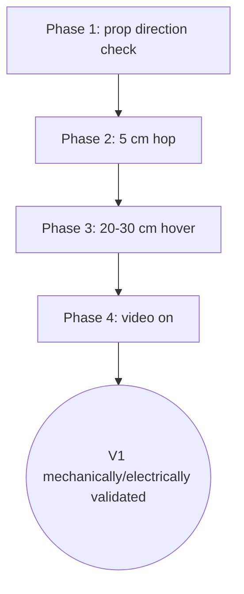

[← Docs index](README.md)

# 06 - First Flight

## Environment

Use a clear, low-risk test area with no people, animals, glass, loose cables or fragile objects in the propeller plane. For the very first lift-off, a large empty indoor space or calm outdoor area is preferable to a small room.

## Phase 1 - prop direction check

Fit props according to the expected Quad-X direction. Arm at the lowest possible output while restraining the frame safely. Immediately disarm if the craft pushes sideways, flips, or any prop loosens.

## Phase 2 - 5 cm hop

Do not attempt a long hover first. Perform a 5 cm hop lasting <1 s. Observe:

- does it remain approximately level?
- does yaw immediately run away?
- does one corner lift earlier?
- is there violent high-frequency oscillation?

Correct mechanical/axis/motor issues before changing PID gains.

## Phase 3 - 20-30 cm hover

Once hop behavior is correct, hover at 20-30 cm for 5-10 s. Land and inspect motor temperatures and frame/motor retention.

## Phase 4 - video on

Repeat the stable hover with the MJPEG stream enabled. Compare:

- flight-loop frequency
- control feel
- Wi-Fi packet loss
- video frame rate
- battery sag

If control quality degrades, lower video load first.

## Initial acceptance criteria

A V1 build is considered mechanically/electrically validated when it can:

- arm/disarm reliably;
- hover for 30 s without divergent oscillation;
- maintain control with the video stream active;
- recover cleanly from modest stick inputs;
- land before battery reaches the configured low-voltage threshold;
- complete 3 flights without motor, frame or camera-mount loosening.

## Do not tune around faults

Common non-PID faults that look like bad tuning:

- IMU not exactly aligned
- loose motor in cup
- bent prop
- wrong prop direction
- wrong motor mapping
- camera/board mass far off center
- battery moving in cradle
- motor electrical noise causing I2C errors
- insufficient battery discharge capability

---
[← 05 - Build and Test](05_BUILD_AND_TEST.md) | [Docs index](README.md) | Next: [07 - Safety and Legal →](07_SAFETY_AND_LEGAL_DE.md)
