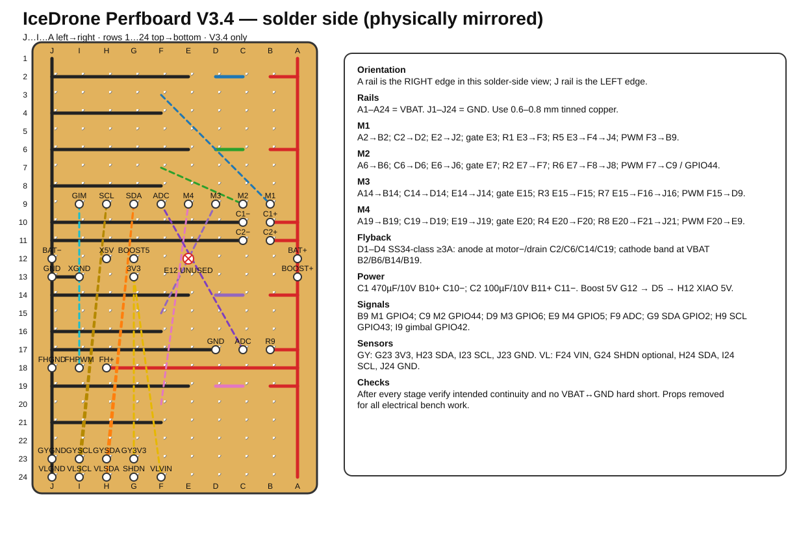

[← Docs index](README.md)

# 10 - Perfboard V3.4: Lötplan und Inbetriebnahme

> **Gültige Revision:** Diese Anleitung gilt für **IceDrone Perfboard V3.4 HW-VERIFIED**.  
> **V3.2 und V3.3 nicht mehr als Lötvorlage verwenden.** V3.4 korrigiert insbesondere M2 auf GPIO44/D7, die VL6180X-Belegung, die XIAO-Stromversorgung und die Motor-Freilaufdioden.



Maschinenlesbare Referenzen:

- [`hardware/perfboard_v34_netlist.csv`](../hardware/perfboard_v34_netlist.csv)
- [`hardware/perfboard_v34_pin_matrix.csv`](../hardware/perfboard_v34_pin_matrix.csv)
- [`hardware/pinmap.csv`](../hardware/pinmap.csv)
- [`hardware/motor_stage_netlist.csv`](../hardware/motor_stage_netlist.csv)

## 1. Koordinatensystem

Die Koordinaten werden **niemals** beim Umdrehen der Platine neu nummeriert.

| Ansicht | links → rechts | oben → unten |
|---|---|---|
| Bauteilseite | A B C D E F G H I J | 1 … 24 |
| Lötseite | J I H G F E D C B A | 1 … 24 |

Fest definiert:

- `A1-A24` = VBAT
- `J1-J24` = GND
- `E12` = **unbenutzt**
- XIAO ESP32-S3 Sense sitzt **nicht** auf der Lochrasterplatine, sondern wird über die vorgesehenen Anschlusspads verbunden.

Markiere vor dem ersten Lötpunkt auf beiden Seiten der realen Platine mindestens `A1`, `J1`, `A24` und `J24` mit einem feinen Permanentmarker.

## 2. Lötstation und Material

Für das vorhandene Sn60PbCu2-Röhrenlot sind folgende Startwerte für die YIHUA YH-853AAA praxisgerecht:

| Arbeit | Startwert |
|---|---|
| normale Lochraster-Lötstelle | 320–330 °C Lötkolben |
| große VBAT/GND-Drahtschiene | 335–350 °C Lötkolben |
| 0603/SOT-23 mit Heißluft | 290–305 °C |
| Heißluftstrom | niedrig, etwa 20–30 % |

Heißluft ist für die **SMD-Bauteile**, nicht zum Aufbau der Stromschienen gedacht. Für VBAT/GND 0,6–0,8-mm-verzinnten Kupferdraht verwenden. Die Motorstrompfade ebenfalls als Draht bzw. sehr kurze, kräftige Verbindungen ausführen und nicht als lange reine Lötzinnbrücken.

Bei altem Röhrenlot zusätzlich Elektronik-Flussmittel verwenden, wenn das Lot schlecht benetzt. Kunststoff-Steckverbinder erst nach den Heißluftarbeiten einbauen.

### AO3400A

AO3400A ist SOT-23. Laut Hersteller-Pinout gilt:

- Pin 1 = Gate
- Pin 2 = Source
- Pin 3 = Drain

Auf 2,54-mm-Lochraster deshalb **SOT-23-Adapter** oder sehr kurze Dead-Bug-Leitungen verwenden. Die Koordinaten im Plan beschreiben die elektrischen Knoten, nicht die mechanische Lage eines direkt eingesteckten SOT-23.

## 3. Prüfprinzip

Nach **jedem** Bauabschnitt:

1. gewünschten Pfad auf Durchgang prüfen;
2. unmittelbar benachbarte Netze auf Kurzschluss prüfen;
3. VBAT gegen GND prüfen;
4. erst danach mit dem nächsten Abschnitt fortfahren.

Bei eingebauten Elkos kann die Widerstandsanzeige beim Messen VBAT↔GND kurz niedrig beginnen und dann ansteigen, weil sich die Kondensatoren über das Multimeter laden. Ein **dauerhafter** Wert nahe 0 Ω ist dagegen ein Fehler.

Keine Propeller während Aufbau oder elektrischer Inbetriebnahme montieren.

---

# 4. Schritt-für-Schritt-Lötplan

## Schritt 1 — Hauptschienen

Auf der **Lötseite**:

- `A1 → A24`: durchgehende VBAT-Schiene, 0,6–0,8 mm verzinnter Kupferdraht.
- `J1 → J24`: durchgehende GND-Schiene, 0,6–0,8 mm verzinnter Kupferdraht.
- `E12` frei lassen.

**Multimeter:**

- `A1 ↔ A24`: Durchgang.
- `J1 ↔ J24`: Durchgang.
- `A1 ↔ J1`: **kein** Durchgang.
- `E12`: weder VBAT noch GND.

Erst nach diesem Test weiterarbeiten.

## Schritt 2 — Motor 1 komplett aufbauen

M1 = hinten links, XIAO D3 / GPIO4.

Bare-Wire-Verbindungen:

- `A2 → B2`: Motor+ / VBAT.
- `C2 → D2`: Motor− / Drain.
- `E2 → J2`: Q1 Source → GND.
- `F4 → J4`: R5-Unterseite → GND.

Bauteile:

- Motor+ Anschluss = `B2`.
- Motor− Anschluss = `C2`.
- D1 = SS34-Klasse ≥3 A: **Anode `C2`, Kathode/Band `B2`**.
- Q1 Drain = `D2`.
- Q1 Source = `E2`.
- Q1 Gate = `E3`.
- R1 100 Ω = `E3 → F3`.
- R5 100 kΩ = `E3 → F4`.
- isolierte PWM-Leitung = `F3 → B9`.

**Prüfung vor Anschluss eines Motors:**

- `E2 ↔ J2`: nahezu 0 Ω.
- `E3 ↔ GND`: ungefähr 100 kΩ.
- `F3 ↔ E3`: ungefähr 100 Ω.
- Diodentest `C2` (rot/+) → `B2` (schwarz/−): typische Schottky-Flussspannung; umgekehrt OL/kein Durchgang.
- `D2 ↔ GND`: kein harter Kurzschluss.
- `B2 ↔ GND`: kein harter Kurzschluss.

Wenn M1 fehlerfrei ist, erst dann die anderen drei Kanäle kopieren.

## Schritt 3 — Motor 2

M2 = hinten rechts, **XIAO D7 / GPIO44**. GPIO3 wird in V3.4 nicht verwendet.

- `A6 → B6`: VBAT.
- `C6 → D6`: Motor− / Drain.
- `E6 → J6`: Q2 Source → GND.
- Q2 Gate = `E7`.
- D2: Anode `C6`, Kathode/Band `B6`.
- R2 100 Ω = `E7 → F7`.
- R6 100 kΩ = `E7 → F8`.
- `F8 → J8`: Pulldown-GND.
- PWM = isoliert `F7 → C9`.

Prüfungen analog zu M1.

## Schritt 4 — Motor 3

M3 = vorne rechts, XIAO D5 / GPIO6.

- `A14 → B14`
- `C14 → D14`
- `E14 → J14`
- Q3 Gate = `E15`
- D3: Anode `C14`, Kathode/Band `B14`
- R3 100 Ω = `E15 → F15`
- R7 100 kΩ = `E15 → F16`
- `F16 → J16`
- PWM = isoliert `F15 → D9`

Prüfungen analog zu M1.

## Schritt 5 — Motor 4

M4 = vorne links, XIAO D4 / GPIO5.

- `A19 → B19`
- `C19 → D19`
- `E19 → J19`
- Q4 Gate = `E20`
- D4: Anode `C19`, Kathode/Band `B19`
- R4 100 Ω = `E20 → F20`
- R8 100 kΩ = `E20 → F21`
- `F21 → J21`
- PWM = isoliert `F20 → E9`

Prüfungen analog zu M1.

### Motorentstörung

Je Motor 100 nF Keramik **direkt an den beiden Motoranschlüssen** vorsehen. Die Motorleitungen nach Möglichkeit paarweise verdrillen.

## Schritt 6 — C1 und C2

- `A10 → B10`: C1 Plus-Zuführung.
- `C10 → J10`: C1 Minus → GND.
- C1 = **470 µF / 10 V low-ESR**, `+` an `B10`, `−` an `C10`.
- `A11 → B11`: C2 Plus-Zuführung.
- `C11 → J11`: C2 Minus → GND.
- C2 = **100 µF / 10 V low-ESR**, `+` an `B11`, `−` an `C11`.

Vor dem Einlöten die Polaritätsmarkierung des konkreten Elkos kontrollieren.

## Schritt 7 — Akku, Boost und XIAO-Versorgung

Akku:

- `A12` = Akku+ / VBAT.
- `J12` = Akku− / GND.

Boost-Modul:

- `A13` = Boost VIN+.
- `J13` = Boost GND.
- geregelter Boost-Ausgang 5 V = `G12`.
- D5 Schottky: **Anode `G12`, Kathode/Band `H12`**.
- `H12` = XIAO 5V.
- `I13 → J13`: XIAO GND.
- `G13` = XIAO 3V3 **Ausgang** für die Sensoren.

**Wichtig:** Rohes 1S-LiHV/VBAT darf in V3.4 **nicht** direkt an XIAO 5V oder BAT gelegt werden.

**Prüfung ohne XIAO:**

- `A12 ↔ A1`: Durchgang.
- `J12 ↔ J1`: Durchgang.
- `A12 ↔ H12`: kein direkter Durchgang.
- Diodentest D5: `G12 → H12` leitend, Gegenrichtung sperrend.
- Boost vor Anschluss des XIAO separat prüfen: Ausgang ungefähr 5 V.

## Schritt 8 — Batterie-ADC

- `A17 → B17`: VBAT zum oberen Teilerwiderstand.
- R9 100 kΩ = `B17 → C17`.
- R10 100 kΩ = `C17 → D17`.
- C3 100 nF = `C17 → D17` parallel zu R10.
- `D17 → J17`: GND.
- ADC-Signal isoliert = `C17 → F9`.
- `F9` später an XIAO D0 / GPIO1.

Ohne XIAO und ohne Akku:

- `B17 ↔ C17`: ca. 100 kΩ.
- `C17 ↔ D17`: ca. 100 kΩ; C3 kann die Messung kurz beeinflussen.
- DC-Verhältnis nach Inbetriebnahme: `V_ADC ≈ VBAT / 2`.

## Schritt 9 — XIAO-Signalanschlüsse

Anschlussfeld Reihe 9:

| Perfboard | Funktion | XIAO |
|---|---|---|
| B9 | M1 PWM | D3 / GPIO4 |
| C9 | M2 PWM | **D7 / GPIO44** |
| D9 | M3 PWM | D5 / GPIO6 |
| E9 | M4 PWM | D4 / GPIO5 |
| F9 | VBAT ADC | D0 / GPIO1 |
| G9 | SDA | D1 / GPIO2 |
| H9 | SCL | D6 / GPIO43 |
| I9 | Gimbal PWM | GPIO42 Testpad |

I²C in der Firmware zwingend explizit initialisieren:

```cpp
Wire.begin(2, 43);
```

GPIO42 kollidiert beim XIAO Sense mit dem PDM-Mikrofon-Clock; das Mikrofon ist in diesem Hardwareprofil daher nicht verfügbar.

## Schritt 10 — GY-91

- `G13 → G23`: 3V3, isoliert.
- `G9 → H23`: SDA, isoliert.
- `H9 → I23`: SCL, isoliert.
- `J23`: GND.

Header:

- `G23` = 3V3
- `H23` = SDA
- `I23` = SCL
- `J23` = GND

## Schritt 11 — VL6180X

Das tatsächlich fotografierte Breakout hat bei Frontansicht, Schrift oben und Stiftleiste unten:

`VIN | 2V8 | GND | GPIO | SHDN | SCL | SDA`

V3.4 nutzt:

- `F24` = VL VIN → XIAO 3V3 (`G13 → F24`, isoliert)
- `G24` = SHDN optional / normalerweise NC
- `H24` = SDA (`G9 → H24`)
- `I24` = SCL (`H9 → I24`)
- `J24` = GND

Am Modul:

- 2V8 = **NC**
- GPIO = **NC**

Die 2V8-Leitung des Breakouts ist ein Reglerausgang und wird nicht mit 3V3 verbunden.

## Schritt 12 — FH-1502 Gimbal

- `A18 → H18`: VBAT.
- `H18` = FH+.
- `I18` = FH PWM.
- `J18` = FH GND.
- PWM isoliert `I9 → I18`.

## Schritt 13 — Abschlussprüfung ohne XIAO, Motoren und Akku

Prüfliste:

- [ ] A1–A24 durchgängig.
- [ ] J1–J24 durchgängig.
- [ ] kein stabiler Kurzschluss VBAT↔GND.
- [ ] E12 frei.
- [ ] Q1…Q4 Source jeweils auf GND.
- [ ] Q1…Q4 Drain jeweils nur am zugehörigen Motor−/Flyback-Netz.
- [ ] Gate-Pulldowns jeweils ca. 100 kΩ nach GND.
- [ ] D1…D4 Band/Kathode jeweils Richtung VBAT/Motor+.
- [ ] D5 Band/Kathode Richtung XIAO 5V (`H12`).
- [ ] C1/C2 Polarität korrekt.
- [ ] M2-PWM geht nach `C9` / GPIO44, **nicht GPIO3**.
- [ ] SDA und SCL nicht vertauscht.
- [ ] VL6180X 2V8 und GPIO bleiben NC.
- [ ] kein direkter VBAT-Pfad zu XIAO 5V.

## Schritt 14 — Erstes Einschalten

1. **Keine Propeller.**
2. XIAO, GY-91, VL6180X, Gimbal und Motoren zunächst abstecken.
3. Wenn verfügbar: Labornetzteil auf etwa 3,7 V und zunächst 100 mA Stromlimit.
4. Rohes VBAT/GND einspeisen. Bei sofortigem Stromlimit: ausschalten und Fehler suchen.
5. Boost-Modul anschließen und dessen Ausgang messen, bevor der XIAO verbunden wird.
6. XIAO zunächst separat per USB testen.
7. Danach XIAO mit der geprüften 5-V-Versorgung verbinden.
8. Sensoren einzeln hinzufügen.
9. Motoren zuletzt, weiterhin ohne Propeller.
10. Mit `firmware/bench_test/` jeden Motor einzeln mit kleiner PWM pulsen.

Bei unerwartetem Motorlauf sofort die Versorgung trennen und zuerst MOSFET-Pinout, Gate-Pulldown und Gate/Drain-Brücken prüfen.

## 5. Empfohlene SMD-Lernreihenfolge

Für die Lochraster-Testplatine:

1. 100-Ω- und 100-kΩ-Widerstände;
2. D5 bzw. eine Schottky-Diode;
3. SS34-Dioden;
4. AO3400A auf SOT-23-Adapter;
5. C3 100 nF;
6. erst danach die größeren Elkos und Steckverbinder.

Bei Heißluft zunächst ein Stück Rest-Lochraster mit einem Ersatzwiderstand oder Ersatz-MOSFET üben. Pads vorverzinnen, Flussmittel verwenden, Teil mit Pinzette positionieren und mit möglichst niedrigem Luftstrom erwärmen.

---

[← 09 - Amazon.de Order List](09_AMAZON_ORDER_LIST_DE.md) | [Docs index](README.md)
