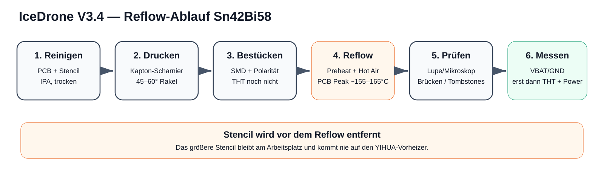
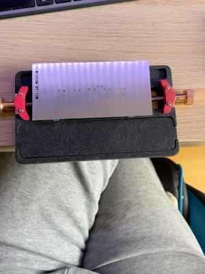
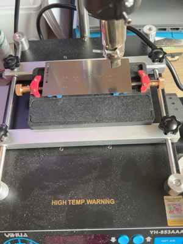
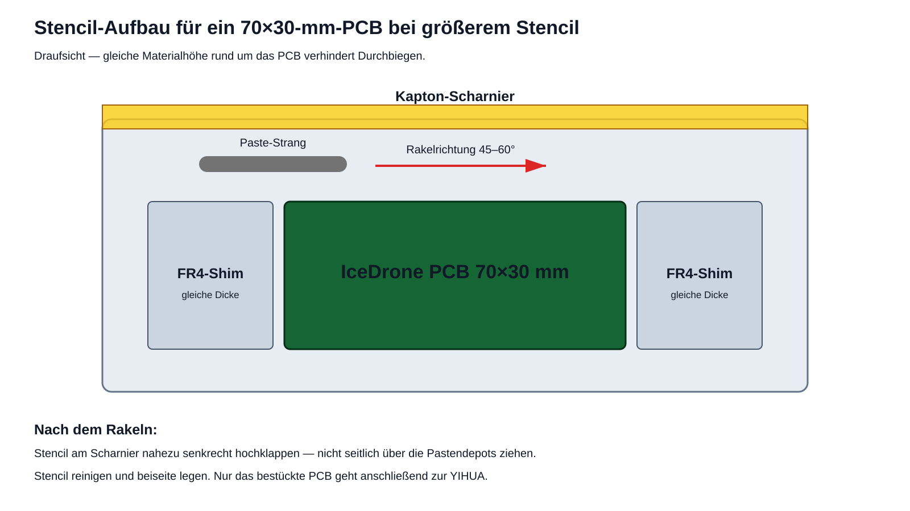
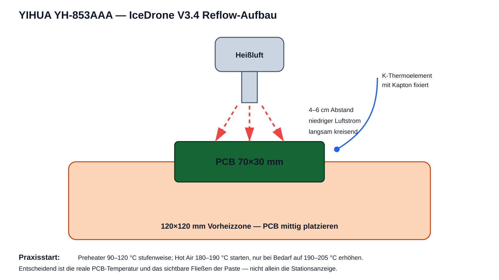
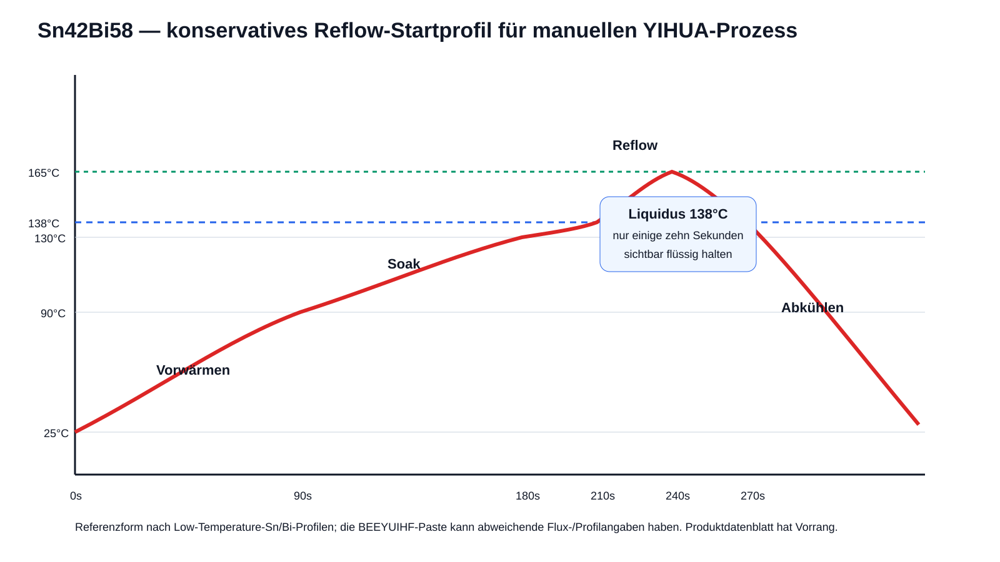
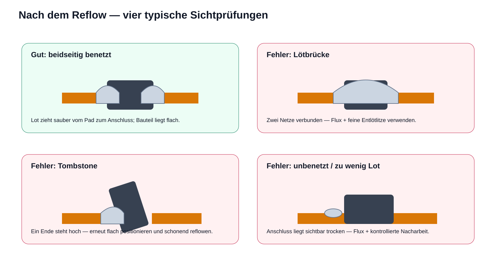

[← Docs index](README.md)

# 11 - PCB-Reflow mit Sn42Bi58 und YIHUA YH-853AAA

**Projekt:** IceDrone V3.4, 70 × 30 mm PCB  
**Paste:** Sn42Bi58, bleifrei, eutektisch, Schmelzpunkt 138 °C  
**Werkzeug:** YIHUA YH-853AAA mit 120 × 120 mm Vorheizer + Heißluft  
**Stand:** 2026-09-18

> Diese Anleitung ist für die erste manuelle Bestückung des IceDrone-V3.4-PCBs mit Stencil gedacht. Sie ist bewusst konservativ ausgelegt. Die Temperaturanzeige der Station ist **nicht** identisch mit der Temperatur am Lötpad. Ein Thermoelement am PCB ist die beste Kontrolle. Wenn die Herstellerangaben der tatsächlich gelieferten Paste von dieser Anleitung abweichen, haben die Angaben auf Paste/Datenblatt Vorrang.

## 0. Realer IceDrone-Aufbau

Die folgenden Fotos dokumentieren den **tatsächlich vorhandenen Stencil-Halter und die YIHUA YH-853AAA**. Sie sind damit die praktische Referenz für diese Anleitung.

### Stencil auf der Spannvorrichtung

Der große Edelstahl-Stencil liegt auf der Spannvorrichtung über dem kleinen IceDrone-PCB. Das ist grundsätzlich passend: Der Stencil darf deutlich größer als die Platine sein, solange er über dem PCB plan aufliegt und sich beim Rakeln nicht durchbiegt. Die roten Klemmbacken dürfen den Stencil bzw. das PCB beim Ausrichten nicht verschieben.

### Spannvorrichtung an der YIHUA

> **Sehr wichtig:** Auf diesem Foto ist der Stencil noch unter der Heißluftdüse zu sehen. Das Foto dokumentiert nur die mechanische Passprobe/Ausrichtung. **Für den tatsächlichen Reflow muss der Stencil vollständig entfernt sein, bevor Vorheizer oder Heißluft eingeschaltet werden.** Auf die YIHUA kommt zum Reflow ausschließlich das bereits mit Paste bedruckte und mit SMD-Bauteilen bestückte PCB.

Die Spannvorrichtung kann zum kalten Ausrichten genutzt werden. Für das Aufheizen soll das PCB anschließend möglichst frei, eben und mittig über der Vorheizzone liegen, damit Metall-Stencil und massive Halter keine unnötigen Wärmebrücken bilden.

## 1. Warum Sn42Bi58 hier anders behandelt wird

Sn42Bi58 ist ein eutektisches Niedrigtemperaturlot. Solidus und Liquidus liegen bei ungefähr **138 °C**. Dadurch kann die Platine deutlich kühler verarbeitet werden als mit SAC305. Als Referenz zeigt ein industrielles Low-Temperature-Profil für eine sehr ähnliche Sn/Bi-Legierung einen langsamen Ramp von Raumtemperatur über 90 °C und 130 °C, dann einen Peak um **165 °C** und anschließendes Abkühlen.

Für die YIHUA bedeutet das: Nicht versuchen, eine SAC305-Reflowtemperatur von 230–250 °C am PCB zu erreichen. Ziel ist vielmehr eine **Pad-/Bauteiltemperatur von ungefähr 155–165 °C** während des eigentlichen Reflows. Die Heißluft muss aufgrund der Wärmeverluste etwas höher eingestellt werden.

**Wichtig für IceDrone:** Bismut-Lote sind mechanisch spröder als typische SAC-Lote. Für diesen Prototyp ist Sn42Bi58 wegen des einfachen, schonenden Reflows praktisch. Motor- und Akkuanschlüsse müssen aber mechanisch entlastet werden; Steckverbinder und schwere Bauteile dürfen nicht über ihre Lötstellen als Zugentlastung dienen.

**Nicht mit dem vorhandenen bleihaltigen Sn60PbCu2 an derselben Lötstelle mischen.** Pb/Bi-Mischungen können niedrigschmelzende Phasen bilden und die Zuverlässigkeit verschlechtern. Für Korrekturen an Sn42Bi58-SMD-Lötstellen daher möglichst wieder Sn42Bi58 bzw. kompatibles bleifreies Material verwenden.

## 1.1 Tatsächlich gelieferte Paste geprüft

Die am 2026-09-19 fotografierte und gelieferte BEEYUIHF-Paste ist auf dem Etikett als **Sn42/Bi58**, **138 °C**, **Particles 25–45 µm** gekennzeichnet. Damit passt die reale Paste zum in dieser Anleitung verwendeten Niedrigtemperatur-Prozess.

Für diese Spritze bleibt das Zielprofil deshalb unverändert: PCB zunächst vorwärmen/soaken und anschließend nur so weit über 138 °C bringen, bis alle Lötstellen sichtbar sauber benetzen. Ein Peak am PCB von ungefähr 155–165 °C bleibt ein geeigneter Startbereich.

## 1.2 Eingegangene SMD-Bauteile: SS34 jetzt bestätigt

Das neue Mikroskopfoto zeigt auf dem größeren 2-poligen SMA/DO-214AC-Bauteil die Markierung **SS34**. Damit sind die vorgesehenen **D1–D4 Motor-Flyback-Schottkydioden** physisch vorhanden und nicht mehr nur über die Gehäuseform vermutet.

Für D1–D4 gilt beim Bestücken:
- Bauteil: SS34, 3-A/40-V-Schottky-Klasse;
- Gehäuse: SMA / DO-214AC;
- **Kathodenband zur VBAT-Seite** des jeweiligen Motorzweigs;
- bei optisch unklarer Bandmarkierung vor dem Setzen mit der Diodentest-Funktion des Multimeters verifizieren.

D5 bleibt ein separates Bauteil der >=1-A-Schottky-Klasse und ist nicht mit D1–D4 zu verwechseln.

## 1.3 Q1–Q4 MOSFETs identifiziert

Die für Q1–Q4 beschafften Transistoren stammen aus einer Amazon.de-Bestellung mit der Produktbeschreibung **„50 Pcs/Set N-Channel Field Effect Transistor A09T MOS Tube for AO3400 AO3400A SOT23.30V 5.8A“**. Damit ist das auf dem Foto sichtbare SOT-23-Bauteil der vorgesehenen **AO3400/AO3400A-Klasse** zuzuordnen.

Die Markierung **A09T** wird von mehreren 3400/AO3400-kompatiblen SOT-23-MOSFETs verwendet. Das für das IceDrone-Layout relevante Pinout ist **Pin 1 = Gate, Pin 2 = Source, Pin 3 = Drain**. Die genaue Orientierung auf dem PCB richtet sich nach dem V3.4-Footprint/Silkscreen und wird vor dem Setzen von Q1–Q4 noch einmal gegen die Bestückungsseite geprüft.

> Die vollständige Amazon-Bestellnummer wird absichtlich nicht im öffentlichen Repository dokumentiert; Produktbezeichnung und Bezugsquelle reichen für die technische Rückverfolgbarkeit aus.

## 1.4 Kondensator-Kit identifiziert

Für die Bulk-Kondensatoren steht das **925 pcs / 36 values Aluminum Capacitor Box Kit** zur Verfügung. Auf dem fotografierten Kasten sind unter anderem **470 µF / 10 V** und mehrere **100-µF-Werte ab 16 V** aufgeführt.

Diese Werte passen von Kapazität/Spannungsfestigkeit grundsätzlich zu C1/C2, **das Foto bzw. Kit-Label weist jedoch keine Low-ESR-Spezifikation nach**. Deshalb sind die Kit-Elkos kein freigegebener 1:1-Ersatz für die endgültige V3.4-Flugbestückung.

Wichtig: Die Kit-Kondensatoren sind radial bedrahtete Aluminium-Elkos. Vor einer eventuellen Bench-Nutzung muss zusätzlich geprüft werden, ob das gefertigte PCB dafür passende Bohrungen/Pads hat. Sind C1/C2 als SMD-Aluminium-Elko-Footprints ausgeführt, passen die radialen Teile mechanisch nicht direkt.

**C3 und die vier 100-nF-Motorkondensatoren kommen nicht aus diesem Elektrolyt-Kit.** Dafür werden separate Keramikkondensatoren benötigt.

## 1.5 SS14-Streifen bestätigt – aber nicht für D1–D4

Die drei vorhandenen Bauteilstreifen sind als **SS14, 1 A / 40 V im SMA-/DO-214AC-Gehäuse** bestätigt. Für die V3.4-Platine gilt trotzdem:

- **D1–D4:** benötigen **B340A-13-F / SS34-Klasse, 3 A / 40 V, SMA (DO-214AC)**. Die vorhandenen SS14 passen zwar mechanisch in die SMA-Footprints, sind dort aber elektrisch unterdimensioniert.
- **D5:** der Produktions-BOM sieht **1N5819W im SOD-123FL-Footprint** vor. Die vorhandenen SS14 sind elektrisch für diese Funktion ausreichend, passen aber voraussichtlich **nicht mechanisch** auf das kleinere D5-Footprint.

Darum werden die vorhandenen SS14 nicht in den ersten PCB-Reflow eingeplant. Der aktuelle Bestandsstatus steht in [`bom/pcb_smd_inventory_v34.csv`](../bom/pcb_smd_inventory_v34.csv).

## 2. Reflow-BOM / Arbeitsplatz

Die maschinenlesbare Liste liegt unter [`bom/reflow_bom.csv`](../bom/reflow_bom.csv).

Unbedingt benötigt werden PCB, passender Stencil, Sn42Bi58-Lötpaste, Kapton-Tape, ein Rakel, Pinzette, Vergrößerung und die YIHUA-Station. Sehr empfohlen sind 99% IPA, fusselfreie Tücher, ESD-Unterlage und ein K-Thermoelement. Für Nacharbeit: No-Clean-Flux und feine Entlötlitze.

> **Solder Balls sind kein Ersatz für Stencil-Lötpaste.** Sie werden für BGA-Reballing verwendet und ergeben auf normalen SMD-Pads keine kontrollierte Lotmenge.

## 3. Vor dem ersten Pastendruck

### 3.1 Paste vorbereiten

Wenn die Paste kühl gelagert wurde, zunächst geschlossen auf Raumtemperatur kommen lassen. Nicht mit Heißluft oder auf dem Vorheizer erwärmen. Anschließend die Spritze vorsichtig durchkneten bzw. gemäß Herstellerangabe homogenisieren.

Die separat bestellte Flux-Paste wird **nicht unter die Stencil-Paste geschmiert**. Die Lötpaste enthält bereits Flussmittel. Zusätzlicher Flux ist nur für spätere Hand-Nacharbeit gedacht.

### 3.2 PCB reinigen

1. PCB an den Kanten anfassen.
2. Pads mit 99% Isopropanol und fusselfreiem Tuch reinigen.
3. Vollständig trocknen lassen.
4. Danach Pads nicht mehr mit den Fingern berühren.

### 3.3 Stencil größer als PCB: kein Problem

Der Stencil wird **nur zum Drucken der Paste** verwendet. Er wird vor dem Bestücken wieder abgenommen und kommt niemals auf den Vorheizer.

**Reale Umsetzung mit deiner Spannvorrichtung:**

Die Vorrichtung ersetzt die einfache Klebeband-/Shim-Lösung teilweise sehr gut. Entscheidend bleibt, dass das PCB selbst nicht wackelt, die Oberkante des PCB und etwaige Auflagen eine plane Fläche ergeben und die Stencil-Aperturen exakt über den Pads sitzen.

Da der Stencil größer als das 70 × 30 mm PCB ist, werden links/rechts bzw. ringsum **FR4-/PCB-Reststücke gleicher Dicke** als Shims aufgelegt. Damit kann der Stencil nicht an der PCB-Kante durchhängen.

Das PCB selbst wird mit kleinen Kapton-Streifen auf der Arbeitsunterlage gegen Verrutschen gesichert. Der Stencil wird an einer langen Seite mit Kapton als **Scharnier** befestigt. Dadurch kann er nach dem Druck nahezu senkrecht angehoben werden.

## 4. Stencil exakt ausrichten

1. Stencil trocken auflegen, noch keine Paste.
2. Unter heller Beleuchtung zuerst die kleinsten Pads ausrichten: AO3400A/SOT-23, Widerstände, kleine Kondensatoren.
3. Danach prüfen, ob auch SS34-/Dioden- und Elko-Pads mittig unter den Aperturen liegen.
4. Erst wenn die Aperturen rundum stimmen, die Scharnierseite mit 2–3 Kapton-Streifen befestigen.
5. Stencil einmal hochklappen und wieder absenken. Er muss exakt in dieselbe Position zurückkehren.

Bei sichtbarem Versatz nicht „später korrigieren“, sondern das Scharnier neu setzen.

## 5. Lötpaste aufrakeln

### 5.1 Paste auftragen

Einen dünnen, durchgehenden Paste-Strang vor die erste Reihe der Aperturen setzen. Mehr Paste ist nicht besser; sie muss lediglich genug Material liefern, um die Öffnungen vollständig zu füllen.

### 5.2 Rakelwinkel und Bewegung

- Rakel/alte feste Plastikkarte: ungefähr **45–60°**.
- Gleichmäßiger Druck.
- Ein ruhiger Druckzug über alle Aperturen.
- Falls sichtbar einzelne Öffnungen nicht gefüllt sind: maximal ein zweiter kontrollierter Zug.
- Nicht wiederholt hin- und herschmieren.

### 5.3 Stencil abheben

Nach dem Rakeln Stencil an der freien Seite anheben und möglichst **senkrecht vom PCB weg** schwenken. Nicht seitlich über die Paste ziehen.

Danach unter Vergrößerung prüfen:

- Pastendepots sauber begrenzt und ungefähr gleich hoch?
- Keine verschmierten Brücken zwischen Nachbarpads?
- Keine fehlenden Pads?
- Keine Paste außerhalb der Pads?

Wenn der Druck deutlich schlecht ist: nicht versuchen, ihn mit Pinzette „zu retten“. PCB mit IPA komplett reinigen und neu drucken. Das ist schneller und sicherer.

Stencil direkt nach dem Druck von beiden Seiten reinigen, solange die Paste noch weich ist.

## 6. Bauteile setzen

Das PCB liegt jetzt ohne Stencil auf einer ebenen Unterlage. Bauteile mit ESD-Pinzette auf die Paste setzen und nur leicht andrücken.

Empfohlene Reihenfolge:

1. kleine Widerstände und Keramikkondensatoren;
2. AO3400A Q1–Q4;
3. D1–D4 / D5;
4. größere SMD-Bauteile und Elkos, falls sie als SMD ausgeführt sind;
5. abschließende Orientierungskontrolle.

THT-Stecker, Stiftleisten, Kabel und andere große Kunststoffteile **erst nach dem Reflow** montieren.

### 6.1 Kritische Orientierungen IceDrone V3.4

- AO3400A: Orientierung exakt nach PCB-Silkscreen/Bestückungsdaten; Gate/Source/Drain nicht nach Gefühl drehen.
- D1–D4 SS34: Kathodenmarkierung/Band auf die vom Layout vorgesehene VBAT-Seite.
- D5: Polarität entsprechend V3.4-Schaltplan.
- C1/C2: Polarität kontrollieren, bevor Wärme auf die Platine kommt.

Vor dem Heizen ein Foto des fertig bestückten, noch kalten PCBs machen. Das hilft später beim Vergleich verschobener Bauteile.

## 7. Aufbau auf der YIHUA YH-853AAA

Die YIHUA hat laut Hersteller einen **120 × 120 mm Vorheizbereich** und einen separat geregelten Heißluftkanal. Das 70 × 30 mm IceDrone-PCB deshalb ungefähr mittig über dem Vorheizer positionieren.

**Realer Stationsaufbau:**

Die Heißluftdüse sitzt in deinem Aufbau gut erreichbar über der Platinenposition. Für den eigentlichen Reflow aber die Edelstahl-Schablone entfernen und möglichst auch unnötige massive Metallteile aus der direkten Heizzone nehmen. Der Luftstrom soll die kleinen Bauteile nicht wegschieben; die Düse deshalb nicht unnötig nahe an die Platine führen.

### 7.1 PCB-Abstand

PCB auf die vorgesehenen Halter/Abstandspunkte der Station bzw. auf temperaturbeständige kleine Supports legen. Es soll nicht schief liegen und nicht während des Reflows bewegt werden.

### 7.2 Thermoelement

Wenn vorhanden, ein K-Thermoelement mit Kapton auf einem repräsentativen GND-/Kupferbereich nahe der dichtesten SMD-Zone befestigen. Die Spitze soll möglichst Kontakt zum PCB haben, nicht frei in der Luft schweben.

## 8. Reflow-Profil als Startpunkt

Die folgende YIHUA-Einstellung ist ein **praxisnaher Startpunkt**, kein kalibriertes Industrieprofil:

| Phase | Ziel am PCB | YIHUA Startwert | Richtwert |
|---|---:|---:|---:|
| 1. sanft vorwärmen | 70–90 °C | Preheater 90–100 °C | etwa 60–90 s |
| 2. soak | 105–125 °C | Preheater 110–120 °C | weitere 60–90 s |
| 3. Reflow starten | >138 °C | Heißluft 180–190 °C, niedrig | langsam kreisend |
| 4. Peak | ca. 155–165 °C | ggf. 190–205 °C Heißluft | nur so lange wie nötig |
| 5. Abkühlen | <138 °C | Heißluft weg, Preheater aus | PCB nicht bewegen |

### 8.1 Luftstrom

Niedrigen Luftstrom verwenden. Bei einer Prozent-Skala ungefähr **20–30%** als Ausgangspunkt. Der Luftstrom muss klein genug sein, dass 0603/0805-Komponenten nicht wandern. Ein eher breites 6–10-mm-Nozzle ist für gleichmäßiges Erwärmen günstiger als eine sehr kleine Düse mit lokalem Hotspot.

### 8.2 Abstand und Bewegung

Mit der Heißluft zunächst ungefähr **4–6 cm** Abstand halten und langsam kreisförmig über die bestückte Zone fahren. Nicht minutenlang auf einen SOT-23-Punkt halten.

### 8.3 Woran der Reflow sichtbar ist

Die Paste verändert sich typischerweise in Stufen:

1. zunächst grau/matt;
2. Flux wird dünn/flüssig;
3. Paste zieht sich plötzlich zusammen;
4. Lot wird metallisch/glänzend und benetzt Pad + Anschluss;
5. kleine Chips richten sich durch Oberflächenspannung leicht selbst aus.

Wenn **alle** Lötstellen sichtbar geflossen sind, noch kurz kontrollieren und dann die Heißluft entfernen. Nicht „zur Sicherheit“ lange weiterheizen.

### 8.4 Zeit oberhalb Liquidus

Für diese manuelle Methode keine exakte Sekunde erzwingen. Als Orientierung sollte die Zeit, in der die Lötstellen tatsächlich flüssig sind, eher im Bereich **einiger zehn Sekunden** liegen und nicht mehrere Minuten betragen. Das Chip-Quik-Referenzprofil für eine nahe verwandte Sn/Bi-Legierung erreicht etwa 165 °C Peak und bleibt nur begrenzt oberhalb 138 °C.

## 9. Abkühlen

Nach dem Reflow:

1. Heißluft wegnehmen.
2. Vorheizer ausschalten.
3. PCB **nicht bewegen**, solange das Lot noch flüssig sein könnte.
4. Natürlich auf deutlich unter 100 °C abkühlen lassen.
5. Keine Druckluft, kein Kühlspray, nicht auf kaltes Metall legen.

Die eutektische Legierung erstarrt beim Unterschreiten von 138 °C relativ abrupt. Trotzdem die Platine erst anfassen, wenn sie sicher handwarm ist.

## 10. Optische Kontrolle

Mit Lupe/Mikroskop jeden SMD-Pin und jedes Pad prüfen.

### Gut

- Bauteil mittig oder plausibel selbstzentriert;
- Lot hat Pad und Anschluss benetzt;
- keine Kugeln oder Brücken zwischen Netzen;
- Dioden/Elkos korrekt orientiert.

### Fehlerbilder

**Lötbrücke:** Lot verbindet zwei benachbarte Pins/Pads. Mit kompatiblem Flux + feiner Entlötlitze korrigieren.

**Tombstone:** Chip steht an einem Ende hoch. Bauteil erneut mit Sn42Bi58/Flux reflowen und flach positionieren.

**Unbenetzte/kalte Stelle:** matte körnige Insel oder Anschluss liegt sichtbar nur auf dem Lot. Mit Flux und moderater Wärme nacharbeiten.

**Zu viel Lot:** große Kugel, Bauteil schwimmt oder Pins verschwinden im Lot. Überschuss mit Entlötlitze abnehmen.

## 11. Elektrische Prüfung vor Versorgung

Noch ohne XIAO, Motoren, Sensoren und Akku:

1. Widerstand VBAT ↔ GND: **kein harter Kurzschluss**.
2. 5V ↔ GND: kein harter Kurzschluss.
3. 3V3 ↔ GND: kein harter Kurzschluss.
4. Q1–Q4: benachbarte SOT-23-Pins auf unbeabsichtigte Brücken prüfen.
5. D1–D4/D5 Polarität erneut kontrollieren.
6. C1/C2 Polarität erneut kontrollieren.
7. Sichtprüfung auf lose Lotkugeln.

Wenn ein Labornetzteil verfügbar ist, den ersten Einschaltversuch strombegrenzt durchführen. Propeller bleiben demontiert.

## 12. THT/Stecker erst nach dem SMD-Reflow

Erst wenn die SMD-Seite optisch und elektrisch plausibel ist:

- JST-/Motorstecker;
- Stiftleisten;
- externe Kabel;
- Batterie-Pigtail;
- Modulstecker

von Hand einlöten. Diese Teile müssen mechanisch entlastet werden. Bei Sn42Bi58 dürfen insbesondere Batterie-/Motorleitungen nicht ständig an der Lötstelle ziehen.

## 13. Nacharbeit

Für Nacharbeit an Sn42Bi58-SMD-Verbindungen:

- No-Clean-Flux sparsam einsetzen;
- moderate Temperatur verwenden;
- möglichst dasselbe bzw. kompatibles bleifreies Lot benutzen;
- vorhandenes Sn60PbCu2 nicht gezielt in die Sn42Bi58-Verbindung einmischen.

Für reine THT-Verbindungen, die elektrisch/mechanisch unabhängig von Sn42Bi58-Lötstellen sind, kann eine andere Lötlegierung technisch möglich sein. In einem Prototyp ist es dennoch übersichtlicher, die verwendeten Legierungen je Baugruppe klar zu dokumentieren.

## 14. Stencil reinigen und lagern

1. Paste grob mit fusselfreiem Tuch abnehmen.
2. Aperturen mit IPA reinigen.
3. Gegen Licht prüfen, ob keine Öffnung zugesetzt ist.
4. Stencil vollständig trocknen.
5. Flach und geschützt lagern; nicht knicken.

## 15. Schnellablauf für die Werkbank

**Reinigen → PCB fixieren → gleichdicke Shims → Stencil ausrichten → Kapton-Scharnier → Paste einmal rakeln → Stencil senkrecht abheben → Druck prüfen → Bauteile setzen → Vorheizen → niedriges Heißluft-Reflow → natürlich abkühlen → Mikroskop → Multimeter → erst danach THT und Strom.**

## 16. Reflow-Prozess als Bildstrecke

Die komplette Arbeitsfolge ist zusätzlich noch einmal bildgestützt zusammengefasst.

### 16.1 Gesamtablauf

**Reinigen → Paste drucken → SMD bestücken → reflowen → optisch prüfen → elektrisch messen.**

### 16.2 Stencil und Pastendruck

Der Stencil liegt beim Drucken plan auf; die Spannvorrichtung oder gleichdicke FR4-Shims verhindern ein Durchbiegen.

### 16.3 YIHUA-Aufbau

Nur das **bestückte PCB ohne Stencil** wird vorgeheizt und anschließend mit niedrigem Heißluftstrom auf Reflow-Temperatur gebracht.

### 16.4 Temperaturverlauf Sn42Bi58

Der 138-°C-Liquidus wird nur kontrolliert überschritten; Zielbereich am PCB ist ungefähr 155–165 °C.

### 16.5 Kontrolle nach dem Reflow

Erst nach Lupe/Mikroskop und Kurzschlussprüfung werden THT-Stecker bzw. externe Module angeschlossen.

### 16.6 Reale Fotos

| Stencil/Spannvorrichtung | YIHUA/Heißluftstation |
|---|---|
|  |  |

> Das rechte Foto zeigt die mechanische Passprobe. Beim tatsächlichen Reflow ist der Stencil bereits entfernt.

## Quellen / Referenzen

- Indium Corporation, Solder Alloys: Bi58/Sn42 = 138 °C eutektisch: https://www.indium.com/products/alloys/solder-alloys/
- Indium Corporation, Low-Temperature Solder PDS: https://documents.indium.com/qdynamo/download.php?docid=3366
- Chip Quik, Low-Temperature Reflow Profile, ähnliches Sn42/Bi57.6/Ag0.4 als Profilreferenz: https://www.chipquik.com/datasheets/SMDLTLFP10.pdf
- YIHUA, YH-853AAA Spezifikation: 120 × 120 mm Preheater, 50–400 °C; Hot Air 100–480 °C: https://www.yihua-gz.com/products/yihua-853aaa-smd-soldering-desoldering-hot-air-gun-preheat-bga-rework-soldering-station

> Das Chip-Quik-Profil ist **nicht das Datenblatt der bestellten BEEYUIHF-Paste**, sondern eine technisch ähnliche Low-Temperature-Sn/Bi-Paste und dient nur als konservative Profilreferenz. Bei abweichenden Angaben auf der BEEYUIHF-Verpackung diese dokumentieren und das Profil entsprechend anpassen.

---
[← 10 - Perfboard V3.4 soldering](10_PERFBOARD_V34_SOLDERING_DE.md) | [Docs index](README.md)
