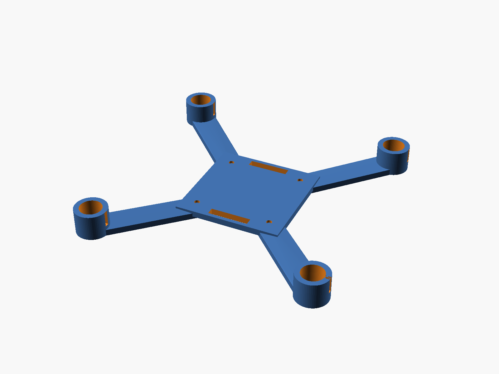
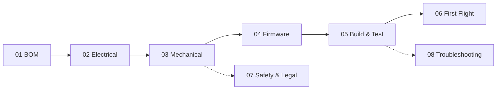

# IceDrone Documentation

ESP32CAM MicroDrone V1 — a small, 3D-printable brushed quadcopter built around the **Seeed Studio XIAO ESP32-S3 Sense** with onboard **OV3660 camera**, Wi-Fi MJPEG video and an Open32Drone-derived flight stack.

This is the full documentation set for the project in [github.com/icepaule/IceDrone](https://github.com/icepaule/IceDrone); also published as a website at **[icepaule.github.io/IceDrone](https://icepaule.github.io/IceDrone/)**.

## Table of contents

| # | Chapter | Covers |
|---:|---|---|
| 01 | [Bill of Materials](01_BOM.md) | Full parts list, sourcing notes, estimated cost |
| 02 | [Electrical](02_ELECTRICAL.md) | Power architecture, motor driver channel, pin map, battery measurement, grounding |
| 03 | [Mechanical](03_MECHANICAL.md) | Frame geometry, CAD renders, print settings, tolerances, center of gravity |
| 04 | [Firmware](04_FIRMWARE.md) | Open32Drone strategy, build settings, video/MAVLink design rules, bench-test firmware |
| 05 | [Build and Test](05_BUILD_AND_TEST.md) | Detailed step-by-step assembly and bring-up, Stage A through J |
| 06 | [First Flight](06_FIRST_FLIGHT.md) | Test environment, hop/hover phases, acceptance criteria |
| 07 | [Safety and Legal (DE/EU)](07_SAFETY_AND_LEGAL_DE.md) | Workshop safety, EU/DE UAS operating category, Wi-Fi/RF notes |
| 08 | [Troubleshooting](08_TROUBLESHOOTING.md) | Common faults and their causes |
| — | [Sources](SOURCES.md) | Upstream projects, documentation and purchase-verification links |

## Suggested reading order

Chapters 07 (Safety & Legal) and 08 (Troubleshooting) are reference material you should read before Stage J of chapter 05, and keep at hand during flight testing, rather than a one-time read.

## Status

| Area | Status |
|---|---|
| Bill of materials | Complete, verified 2026-09-02 |
| Electrical (pin map, netlist, wiring diagram) | Complete |
| Mechanical CAD (frame, cradles, prop guard) | Parametric OpenSCAD + STL + renders in [`cad/`](../cad/) |
| Bench-test firmware | Complete, in [`firmware/bench_test/`](../firmware/bench_test/) |
| Flight-critical firmware | Not included — tracks upstream Open32Drone, see [04 - Firmware](04_FIRMWARE.md) |
| Build/fetch helper scripts | Not yet included |

## Related top-level files

- [`../README.md`](../README.md) — project overview and quick start
- [`../bom/bom.csv`](../bom/bom.csv), [`../hardware/`](../hardware/) — machine-readable BOM, pin map and netlist
- [`../cad/`](../cad/) — OpenSCAD sources, STL exports, renders
- [`../firmware/bench_test/`](../firmware/bench_test/) — pre-flight bench firmware
- [`../LICENSE`](../LICENSE), [`../NOTICE`](../NOTICE) — Apache-2.0 licensing
